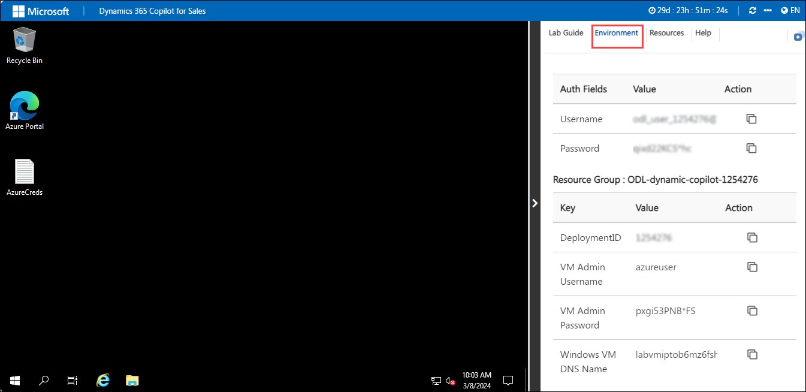
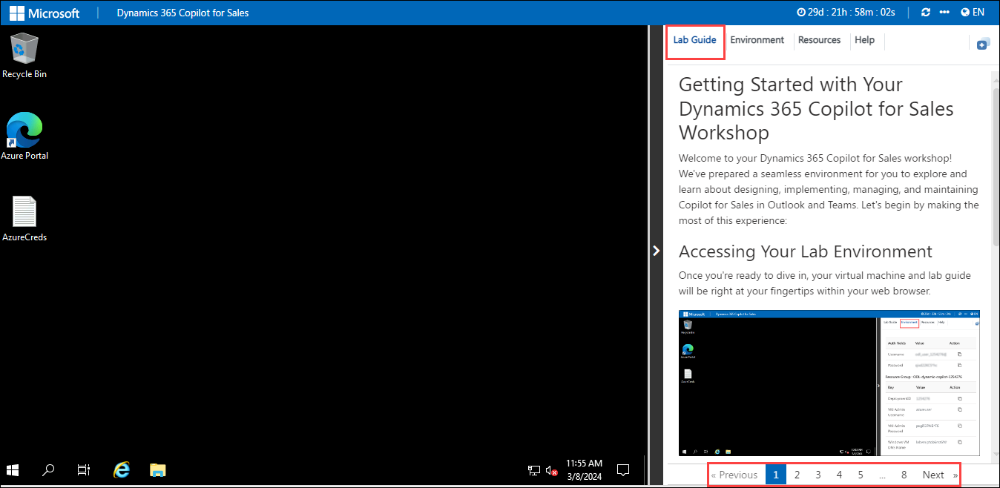
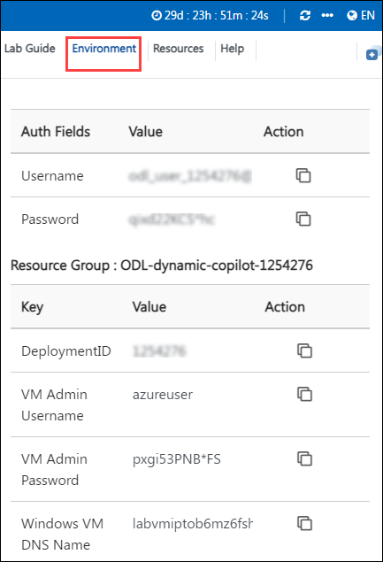
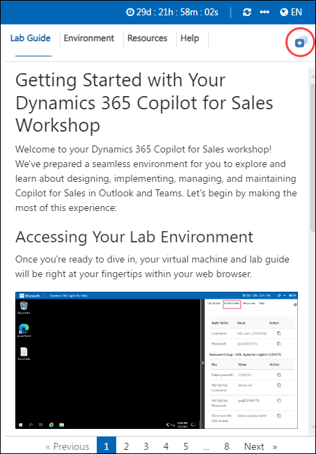
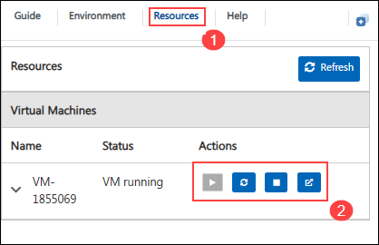
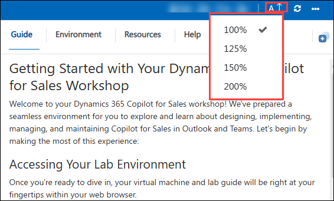
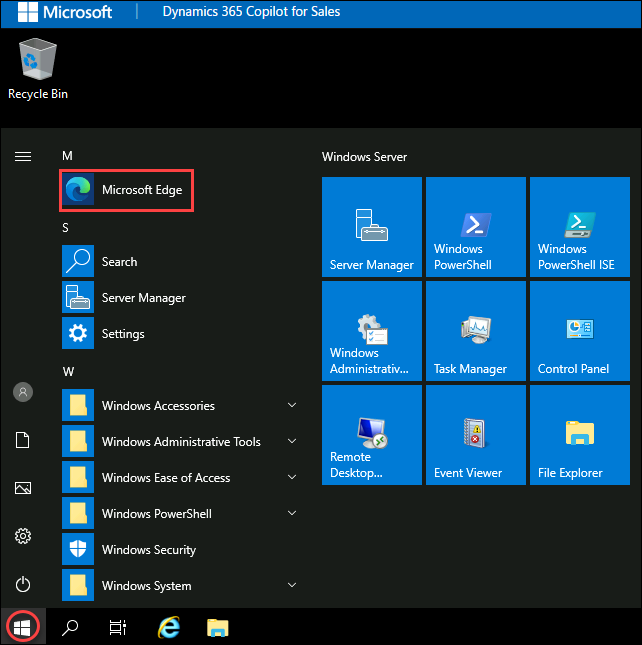

# Getting Started with Your Dynamics 365 Copilot for Sales Workshop
 
Welcome to your Dynamics 365 Copilot for Sales workshop! We've prepared a seamless environment for you to explore and learn about designing, implementing, managing, and maintaining Copilot for Sales in Outlook and Teams. Let's begin by making the most of this experience:
 
## Objective 

- **Pre-Configuration and Setup for Microsoft Copilot for Sales :** In this lab, you will set up the foundational environment needed for Copilot for Sales by creating a Power Apps environment with Dataverse, installing Copilot for Sales in Outlook and Teams, and configuring necessary policies in Microsoft Teams to enable recording and transcription for AI-driven sales meeting analysis.

- **Getting Started with Microsoft Copilot for Sales :** The objective of this lab is to help you **integrate Microsoft Copilot for Sales** into your daily workflow by accessing it through **Outlook, Calendar, and Teams**, and **connecting it to CRM environments** like Dynamics 365 or Salesforce. This enhances productivity, provides AI-driven sales insights, and supports better customer engagement.

- **View and update CRM data in the flow of work :** In this lab, you will learn how to **view, create, connect, and update CRM data** directly from Outlook and Teams using **Microsoft Copilot for Sales**. You'll perform tasks like creating contacts from emails, linking records, saving activities to CRM, and adding private notes — all within your workflow. This helps reduce context switching and ensures your CRM is always up to date.

- **Use AI to supercharge sales communication :** In this lab, you will learn how to use Copilot for Sales to summarize emails and draft replies using AI. You'll explore features like viewing email summaries, saving them to CRM, generating replies using predefined categories or custom prompts, and sharing feedback. This improves sales communication and keeps CRM data accurate with minimal effort.

- **Drive AI-powered sales :** In this lab, you will explore how to leverage Copilot for Sales within Microsoft Teams to elevate your sales meetings. You’ll learn to schedule meetings, record and transcribe conversations, and utilize AI-generated summaries to capture insights, track action items, and create follow-up tasks—enhancing sales efficiency and collaboration.

- **Customize Microsoft Copilot for Sales (in Teams and Outlook) :** In this lab, you will learn how to customize Microsoft Copilot for Sales within Teams and Outlook by configuring CRM record types, managing fields, and setting editing permissions. You will also explore additional Copilot features such as switching environments, diagnostics, and feedback options to tailor the sales experience to your organization’s needs.

## Prerequisites
Participants should have: Basic knowledge and understanding of the following

- Microsoft Power Platform
- Microsoft Teams
- Microsoft Outlook
- CRM basics (Dynamics 365)

## Accessing Your Lab Environment
 
Once you're ready to dive in, your virtual machine and lab guide will be right at your fingertips within your web browser.
 
    

### Virtual Machine & Lab Guide
 
Your virtual machine is your workhorse throughout the workshop. The lab guide is your roadmap to success.

    
 
## Exploring Your Lab Resources
 
To get a better understanding of your lab resources and credentials, navigate to the **Environment Details** tab.
 
    
 
## Utilizing the Split Window Feature
 
For convenience, you can open the lab guide in a separate window by selecting the **Split Window** button from the Top right corner.
 
    
 
## Managing Your Virtual Machine
 
Feel free to start, stop, or restart your virtual machine as needed from the **Resources** tab. Your experience is in your hands!
 
   

## Lab Guide Zoom In/Zoom Out

To adjust the zoom level for the environment page, click the A↕ : 100% icon located next to the timer in the lab environment.

   

## Let's Get Started

1. On your virtual machine, click on **Start**.

1. Select **Microsoft Edge**.

      

# Support Contact
The CloudLabs support team is available 24/7, 365 days a year, via email and live chat to ensure seamless assistance at any time. We offer dedicated support channels tailored specifically for both learners and instructors, ensuring that all your needs are promptly and efficiently addressed.

Learner Support Contacts:

  - Email Support: cloudlabs-support@spektrasystems.com
  - Live Chat Support: https://cloudlabs.ai/labs-support

Now, click on Next from the lower right corner to move on to the next page.

 

Happy Learning!!
