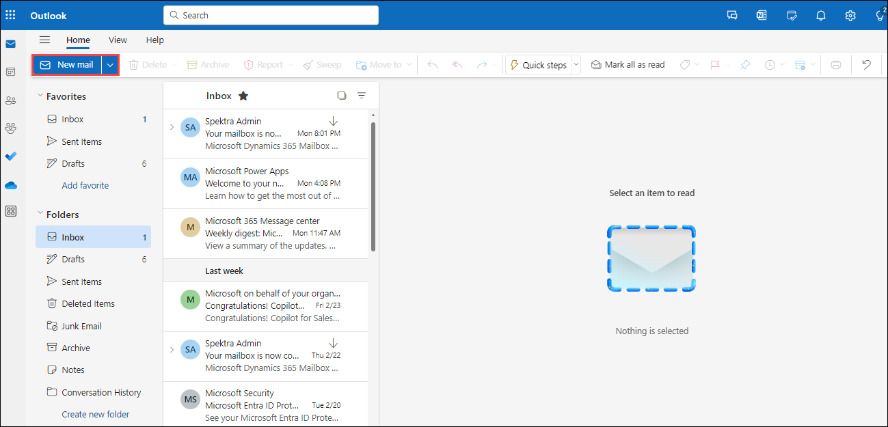
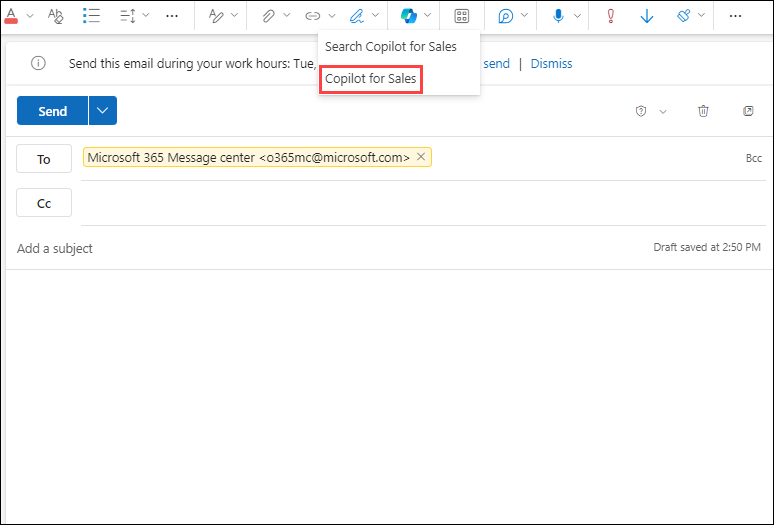
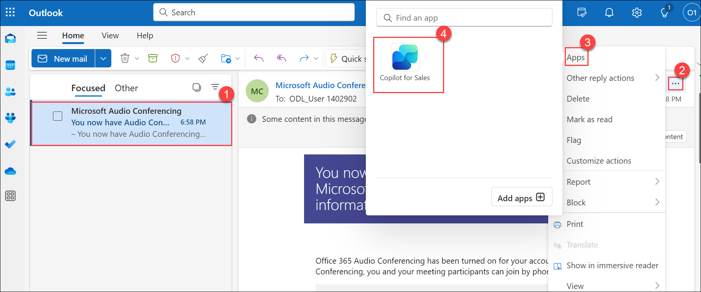
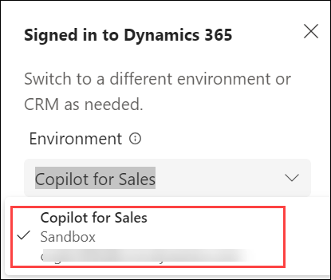

# Lab 01: Getting Started with Microsoft Copilot for Sales

## Lab Scenario

Introducing the Copilot for Sales app – your all-in-one solution for smoother sales management. With this tool, accessing CRM data from Outlook is a breeze. Simply sign in to your CRM directly from your email platform, streamlining your workflow and boosting productivity. Get ready to revolutionize your sales process with Copilot for Sales!

## Lab Objectives

In this lab, you will perform:

- Access the Copilot for Sales app
- Sign in to CRM from Outlook

## Task 1: Access the Copilot for Sales app

- While drafting an email or creating a meeting

1. In Outlook, click on **New Mail**.

      

1. Mention the email of the receiver, click on **Insert (1)** , then **Apps (2)** and select **Copilot for Sales (3)**.

   

1. Click on **Copilot for Sales** again.

   
   
- While reading an email

1. Open any **customer mail (1)**,then click on **...(2)** inside the mail,  click on **Apps (3)** and select **Copilot for Sales (4)**.
   
   

- Create a Team meeting
1. Click on **Calender (1)** and select **New event (2)**

    

2. Add the title in the **title field (1)** and click on **Save (2)**.

    
   
- While opening a meeting

1. Open Calendar in Outlook and select the scheduled meeting.
   
1. Select **More commands (...)** and then select **Copilot for Sales** (in Simplified ribbon)

   

- Access Copilot for Sales in Teams
  

1. Select **Apps** , search for **Copilot for Sale**s and click on **Add**.
   
   

1. Click on **Add**.

    
   
## Task 2: Sign in to CRM from Outlook

1. In Outlook, open a customer mail, click on **Apps** and select **Copilot for Sales**.
   
1. In the **Copilot for Sales** pane, select **Switch environment** in the Signed in to Dynamic 365 banner at the top.

   
  
1. Choose the **Environment** where you wish to sign in.

   

1. Click on **Get Started**.

   
   
**Note:** - You can also sign in through Salesforce CRM:  
- Select your **Salesforce environment**, and then select **Sign in**.   
- In the confirmation message, select **Allow**.
- Enter your Salesforce credentials, and then select **Log In**.   
- Select **Allow**, and then select **Allow access**.

## Review

In this lab, you have understood how to access the copilot for sales app and signed in.

### You have successfully completed the lab
