# Lab 02: View and update CRM data in the flow of work

# CRM Actions

## Lab Overview

Microsoft Copilot for Sales reduces the need for frequent context switching so that you can find the information that you need. Keeping the correct CRM data accessible and in the flow of work in Outlook and Teams makes updates and references to CRM data near effortless.

In this lab, you will explore the features of Microsoft Copilot for Sales, which helps you create new contacts or leads directly from your Outlook inbox to keep track of your stakeholders. When you send or receive an email from a customer not tracked in your CRM, Copilot suggests adding them. You will learn to create new contacts or leads using the customer's email signature. Copilot ensures related contacts, opportunities, and account records are easily accessible.

## Lab Objectives

In this lab, you will perform:

- Task 1: Create a contact in your CRM from Copilot for Sales 
- Task 2: Connect a contact to your CRM
- Task 3: Change the connected CRM contact 
- Task 4: View and update CRM data 
- Task 5: Search and share CRM data
- Task 6: Connect and save emails and meetings to CRM 
- Task 7: View recent and upcoming activities
- Task 8: Add private notes
  
## Task 1: Create a contact in your CRM from Copilot for Sales 

In this task, you will learn how to create new CRM contacts directly from Copilot for Sales, either by entering details manually or by capturing information from an existing email. This ensures customer data is quickly added and tracked without leaving Outlook.

### Task 1.1: Create a new Record

In this task, you will learn how to create a new contact record manually within the Copilot for Sales environment.

1. Navigate back to **Copilot for sales** environment, if you have switched the environment in the previous lab.

1. Click on the **ellipses(...) (1)** , then select **Switch environment (2).**

     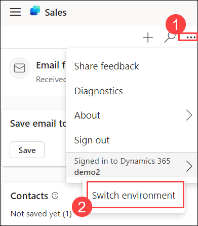

1. Select **Copilot for Sales** and click **OK.**

     

1. Click on **(+)** on the top right once signed in to create a new record.

     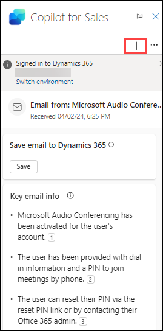

1. Click on **+ Create Record**.

      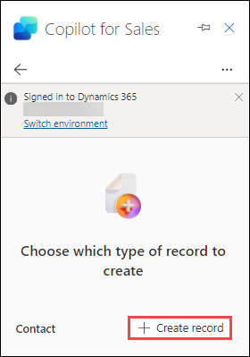
  
1. Add the details for the contact. Rest keep it as it is and click on **Save**.

    > - **First name** : Dynamics
  
    > - **Last name** : 365
    
    > - **Email** : dynamics365@gmail.com
  
     
   
    > **Note:** If prompted save this email as part of this contact record click on **Save.**
         
    > **Note:** Please create one more contact record by following the same steps, with your name and email address that your going to use in ***Lab 4 - Task 4.***

### Task 1.2: Create a contact from an exisiting Email

In this task, you will learn how to create a contact by extracting details from an existing email using Copilot for Sales.
  
1. Open a mail from the inbox then click on the **elipses(...).**

1. Click on **Apps** and select **Copilot for Sales**, and then select **Add to Dynamics 365** beside your contact.

    >**Note:** Contacts name can be anything based on your customer or recieved email.

   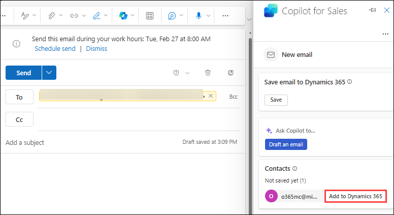

1. In the **New contact** form, add the required information, and then select **Save**.
   
   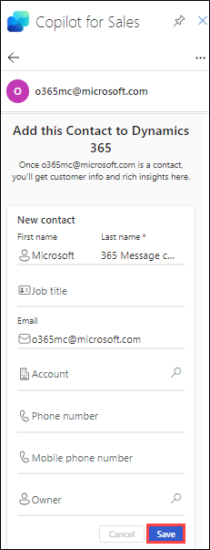

    >**Note:** ***First name, Last name and Email*** is based on your customer or recieved email. Not necessary to match with the Screenshot.   
   
### Task 2: Connect a contact to your CRM 

In this task, you will learn how to link a saved contact with other records in Dynamics 365, assign roles, and establish meaningful relationships.

**Note:** We can link a contact to another contact if there are already two or more contacts saved. If there is only one contact select **Create a new contact** to create a contact.

1. Open the mail, and open the Copilot for Sales pane from it. Click on the **More Options(...) (1)** beside the saved contact and click  **Open in Dynamics 365 (2)**.

    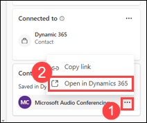

1. Click on **Connect** on the top.

     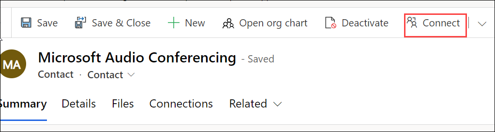

1. Select the record and provide a **role** and a **description** based on the connection you would like to create in the **Connect To** tab. 

    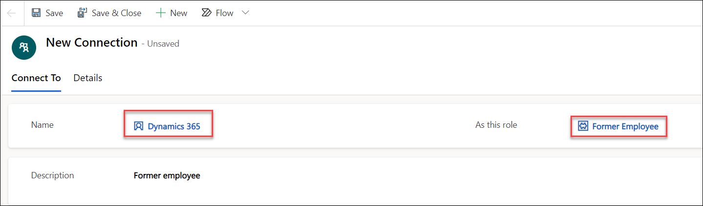
   
1. Navigate to **Details** tab, choose the **Owner** and click on **Save and Close**.

    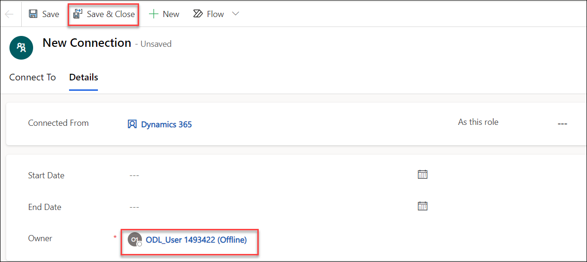

### Task 3: Change the connected CRM contact 

In this task, you will learn how to edit and update existing CRM connections by modifying contact names, roles, or descriptions.

1. Open the email, click on **Apps** then select **Copilot for Sales**. Scroll down then hover the cursor on the saved contact then click on the **More Options(...) (1)** and select **Open in Dynamics 365 (2)**.

   

1. Click on **Related (1)** drop-down and select **Connections (2)**.

   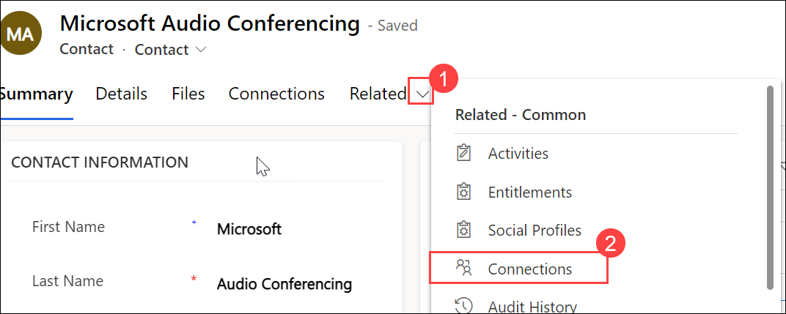
   
1. Choose any existing connection **(1)** and click on **Edit (2)**.

   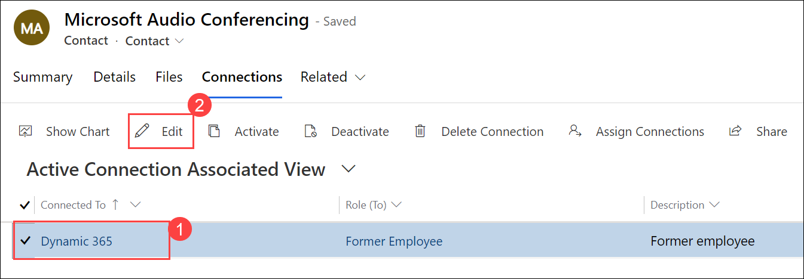

1. Change the **contact name (1), role (2) and description (3)**  based on the connection you would like to create then click on **Save and Close (4).**

   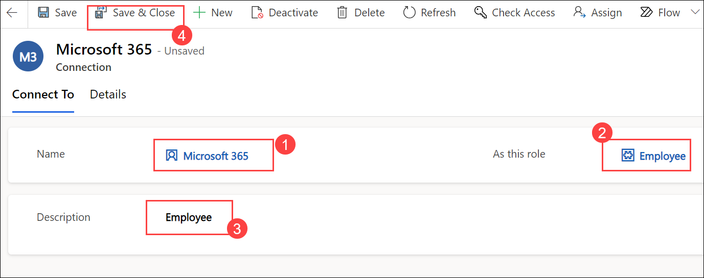

1. Click on **Save and Close** and verify its changed.

   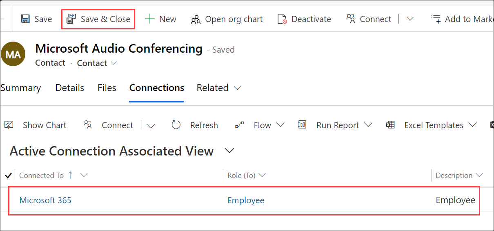

### Task 4: View and update CRM data 

In this task, you will learn how to open CRM records through Copilot, review details, and make updates directly in Outlook.

1.	Open the **Copilot for Sales** pane and select a record you want to edit.

1.	In the record's details cards, select **More actions (...)** and then select **Edit record**.

      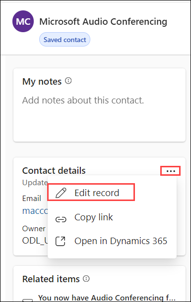

1.	Update the details as needed and select **Update**.

### Task 5: Search and share CRM data

In this task, you will learn how to quickly search for CRM records and share links via Outlook or Teams to support collaboration.

1.	In Outlook, open the **Copilot for Sales** pane.

1.	In the (record type) card, scroll down and select the saved contact, clcik on the **ellipses (...)** and select **Copy link**.

      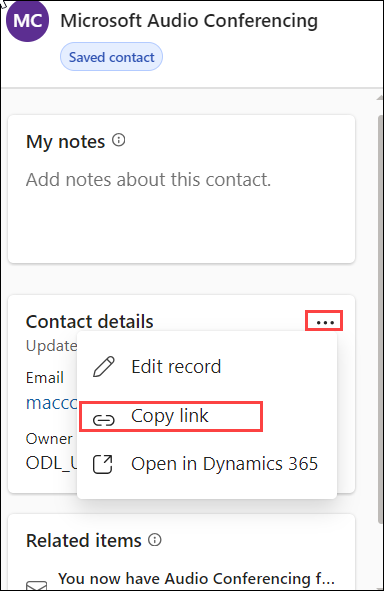

1.	Paste the ***link*** in a Teams chat or email.

1. In Teams, open any customer chat and click on **More Options(...)** and select **Copilot for Sales**.

   > **Note:** If there is no chat in teams. Please send a greetings mail from your personal outlook mail to the ODL_User and Click on the edit button in teams and paste your email/username.
    
    - Navigate to your personal Outlook, click on **New mail (1)** then provide the ODL_User email **(2)** given in the LabVM's Environment tab then type a greeting message **(3)** and then click on **Send (4).**

       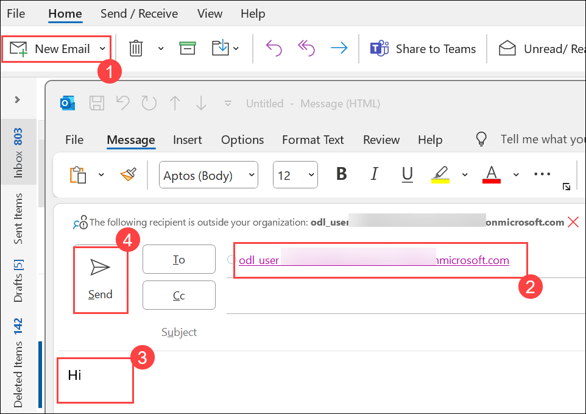

    - Click on the edit **(2)** button in teams and paste your email/username **(2)**.
  
       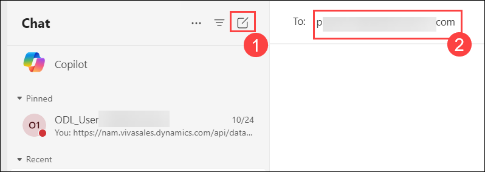

1. Paste the link in chat and Attach any required contact and the CRM record of that contact can be shared with anyone over teams.

   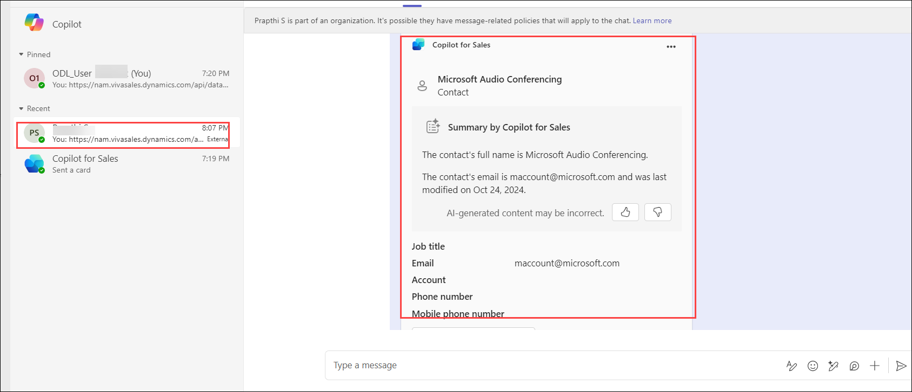

### Task 6: Connect and save emails and meetings to CRM 

In this task, you will learn how to connect and save emails or meetings to CRM records, ensuring all interactions are logged.

1.	Open the email or meeting you want to save to the CRM, and then open **Copilot for Sales**.

1.	Select **Save** under **Save email to Dynamics 365**.

      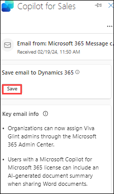

1. If prompted, cLick on **Turn on** for **server-side synchronization** when prompted.

1.	Under **Connect to a record**, select the record **(1)** you want to connect the activity to, if  the records are not coming up please search the name and select **Save (2)**.

      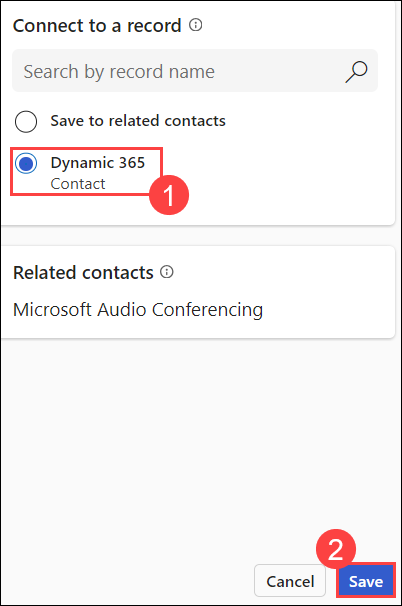

      **Note:** If you want to save the email or meeting to CRM without connecting to a record, select **Save without connecting**. The email or meeting will still be associated with contacts on the To, Cc, and Bcc fields.

### Task 7: View recent and upcoming activities

In this task, you will learn how to view related activities such as past communications or upcoming meetings linked to CRM contacts.

1. Open any email or meeting and then open **Copilot for Sales** pane and select the saved contact.

      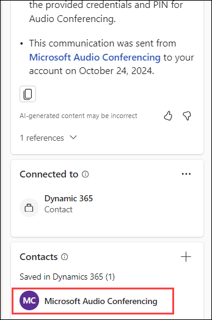

1. Click on any **Related Items** you want to view and it opens the item in a new tab.

      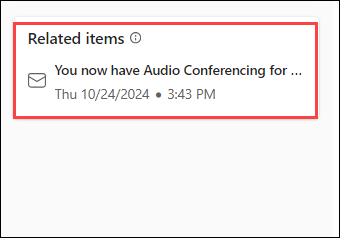

### Task 8: Add private notes

In this task, you will learn how to add private notes to CRM contacts, allowing you to capture personal insights and reminders.

1.	Open the **Copilot for Sales** pane.

2.	In the **Contacts** card, select the contact to which you want to add notes.

3.	Enter your **notes** about the contact in the **My notes** card.

      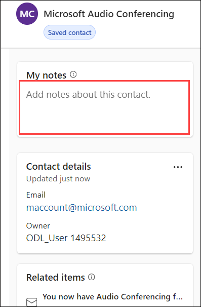

4.	Select anywhere outside the Private notes card to save the note.

## Summary

In this lab, you have completed the following tasks:

- Created new contacts in CRM from Copilot for Sales (via Outlook and existing emails)
- Connected and managed CRM contacts, including changing related connections
- Viewed and updated CRM records directly within Outlook and Teams
- Searched, copied, and shared CRM data across Outlook and Teams
- Connected and saved emails and meetings to CRM records
- Viewed recent and upcoming activities linked to contacts
- Added private notes to CRM contacts for reference

### You have successfully completed the lab. Now click on Next from the lower right corner to move on to the next page.

 
