# Lab 03: Use AI to supercharge sales communication 

## Lab Scenario

With Microsoft Copilot for Sales, sellers can stay informed on customer interactions, seamlessly update CRM records, and access the correct data to inform conversations with customers, all while complying with business processes.

Microsoft Copilot for Sales uses the power of generative AI to reimagine the sales experience, helping you stay in the flow of your work in Outlook, Teams, and Word.

## Lab Objectives

In this lab, you will perform:

- View and save email summary to CRM
- Draft an email message  

## Excercise 1: View and save email summary to CRM

### Task 1: View email summary

1. In **Outlook**, open or reply to a customer email.

1. Open the **Copilot for Sales** pane.

1. The **email summary** is displayed in the **Key email info** card.

   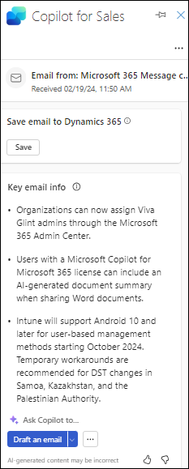

### Excercise 2: Draft an email message  

### Task 2: Create an email reply using pre-defined categories

1. Open a customer email and select **Reply**. In the banner message at the top of the draft email, select **Apps** and select **Copilot for Sales**.

1. Choose any of the **pre-defined categories** provided under **Draft with Copilot**

   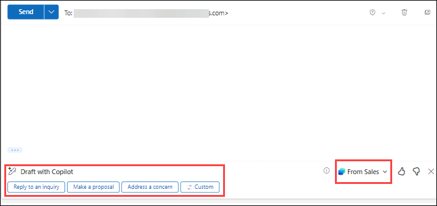
   
1. Review the **suggested** content.
   
1. Select **Keep it** to paste the content in the email body.

   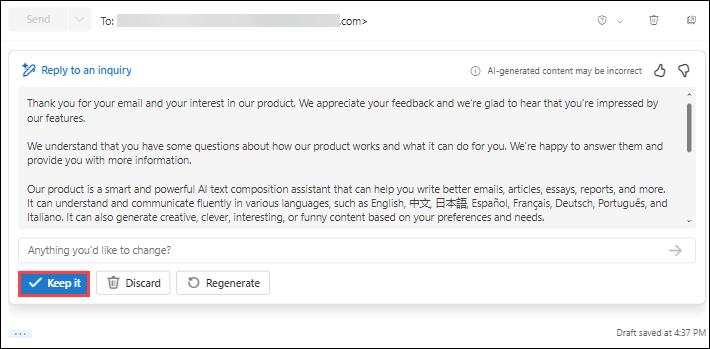

      **Note:** To generate a different suggestion, select **Regenerate**.

1. Edit the email content as required, and then **send** it.

   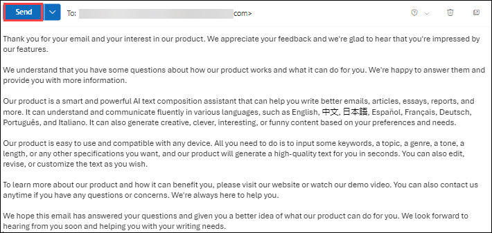

### Task 2.1: Create an email message using custom prompt

1. Open a customer email and select **Reply**. In the banner message at the top of the draft email, select **Apps** and select **Copilot for Sales**.

1. Select **Draft an email**.

1. In the textbox, enter a phrase to describe the kind of reply you want to send.

1. To use a suggested prompt, click the **icon** as depicted in the below image and then **choose** a prompt.

   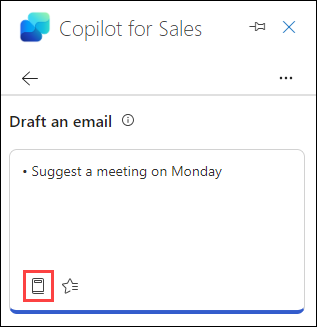
   
1. To use a saved prompt, click the **icon (1)**  as depicted in the below image and then **choose** the prompt you want to use and select **Create  (2)** draft.

   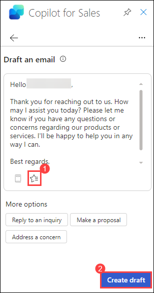

1. **Review** the suggested content.

1. Click on the icon depicted in the image below to **adjust draft**.

      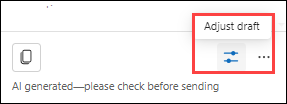

1. You can make the following changes while saving draft and click on **Update**

      - Under **Length**, select the content length you want to use (1)
      - Under **Adjust tone**, select the tone you want to use (2)
      - Under **Draft language**, select the language you want to use (3)
      - Under **Add details**, enter the changes you want to be made in the content(4), .For example, provide a 10% discount on the next purchase.

        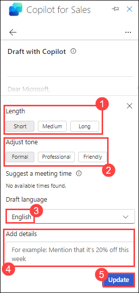

1. To **generate** a different suggestion, select **More options**, and then select **Try again**.

   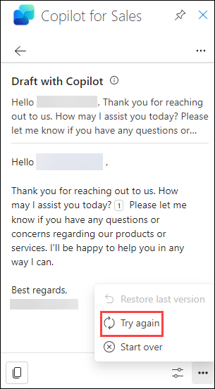
   
      **Note:** Refine the suggested content, if required. You can also restore the suggested content to the previous version.
   
1. Select **Add to email** to paste the content in the email body.

   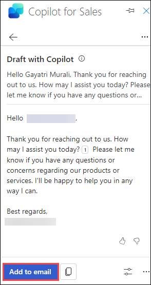

1. **Edit** the email content as required, and then **send** it.

- Alternate method 

1. Open a customer email and select **Reply**. In the Draft with copilot select **Custom**.

      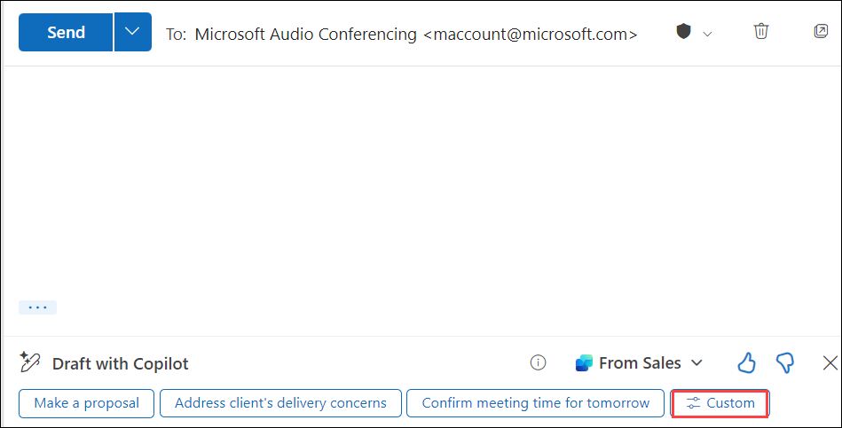

1. Type the Draft message you want to type and click on **Generate** to generate the draft.

      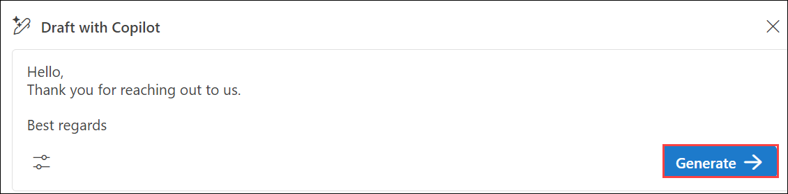

1. Click on the highlighted icon to adjust the draft.

      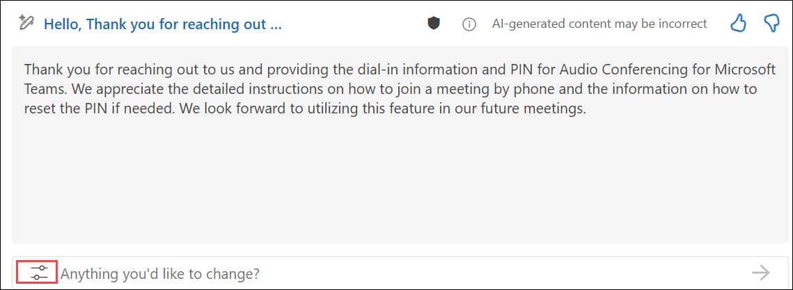

1. Use the following options to adjust the draft, after making the required adjustments, click on **Keep it** and click on **Send**.

      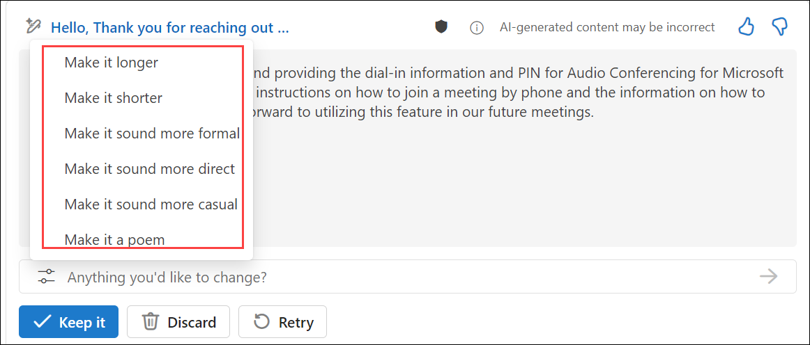

### Task 3: Share feedback

1. At the bottom of the **email summary**, select a **thumbs-up** or **thumbs-down** based on your experience.

1. After you select an icon, you'll get a **Tell us more** link.

   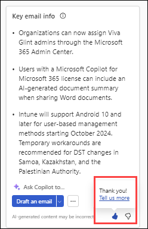

1. Select the link to open the **feedback** form.

1. Enter your responses in the feedback form and then select **Send**.

## Review

In this lab, you have understood how to draft an email, view and save the email summary.

### You have successfully completed the lab.
