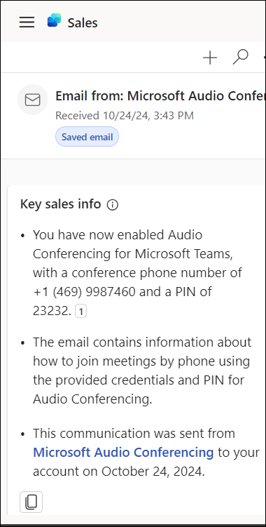
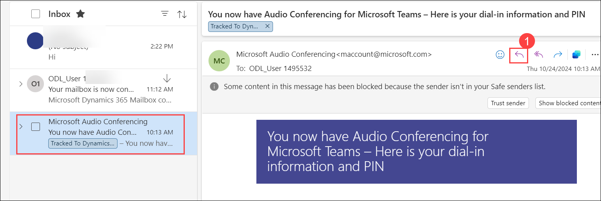

# Lab 03: Use AI to supercharge sales communication 

## Lab Overview

This lab demonstrates how Copilot for Sales streamlines CRM updates from customer email interactions. Instead of manually updating CRM systems, which can be time-consuming and error-prone, Copilot for Sales uses AI to summarize email conversations. These summaries can be efficiently added as notes to your CRM records, highlighting key details like budget, stakeholders, needs, and timing for external emails when detected with high confidence. You will learn to set up and use Copilot for Sales to enhance your CRM update process.

## Lab Objectives

In this lab, you will perform:

- Task 1: View and save email summary to CRM
- Task 2: Draft an email message
- Task 3: Share feedback

## Task 1: View and save email summary to CRM

In this exercise, you will learn how to use Copilot for Sales to generate AI-powered email summaries and save them directly to CRM records for quick and accurate updates.

1. In **Outlook**, open or reply to a customer email.

1. Open the **Copilot for Sales** pane.

1. The **email summary** is displayed in the **Key email info** card.

   

### Task 2: Create an email reply using pre-defined categories

In this task, you will learn how to use Copilot’s pre-defined reply categories to generate email drafts quickly and tailor them before sending.

1. Open a customer email and select **Reply (1)**. 

   

1. Choose any of the **pre-defined categories** provided under **Draft with Copilot**

   
   
1. Review the **suggested** content.
   
1. Select **Keep it** to paste the content in the email body.

   

      **Note:** To generate a different suggestion, select **Regenerate**.

1. Edit the email content as required, and then **send** it.

   

### Task 2.1: Create an email message using custom prompt

In this task, you will learn how to create fully customized email drafts by providing your own prompts to Copilot for Sales, enabling personalized and contextually relevant replies.

1. Open a customer email and select **Reply**. Under ***Draft with copilot*** select **Custom**.

      

1. Type the Draft message you want to type and click on **Generate** to generate the draft.

      

1. Click on the highlighted icon to adjust the draft.

      

1. Use the following options to adjust the draft, after making the required adjustments, click on **Keep it** and click on **Send**.

      

### Task 3: Share feedback

In this task, you will learn how to provide feedback on Copilot’s summaries and drafted responses to improve AI-generated outputs.

1. At the bottom of the **email summary**, select a **thumbs-up** or **thumbs-down** **(1)** based on your experience.

1. After you select an icon, you'll get a **Tell us more (2)** link.

   

1. Select the link to open the **feedback** form.

1. Enter your responses in the feedback form and then select **Send**.

## Summary

In this lab, you have completed the following tasks:

- Viewed AI-generated email summaries in Outlook using Copilot for Sales
- Saved key email insights directly to CRM records
- Drafted customer email replies using pre-defined categories
- Created customized email drafts using custom prompts with Copilot
- Adjusted and finalized draft content before sending
- Shared feedback on AI-generated summaries and drafts

You have successfully completed the lab. Now click on Next from the lower right corner to move on to the next page.

 
