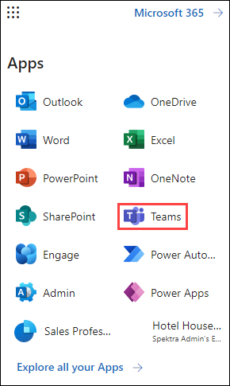
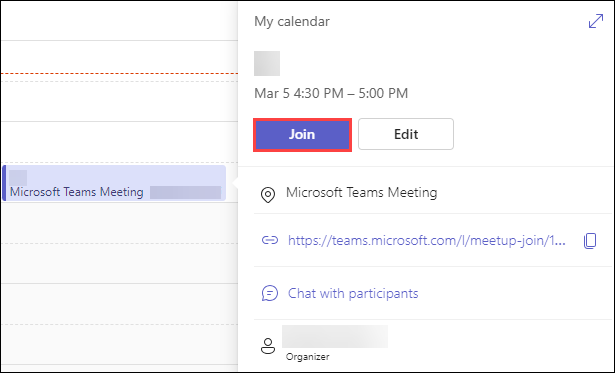
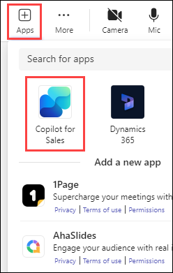
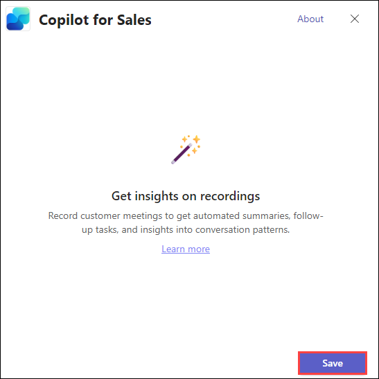
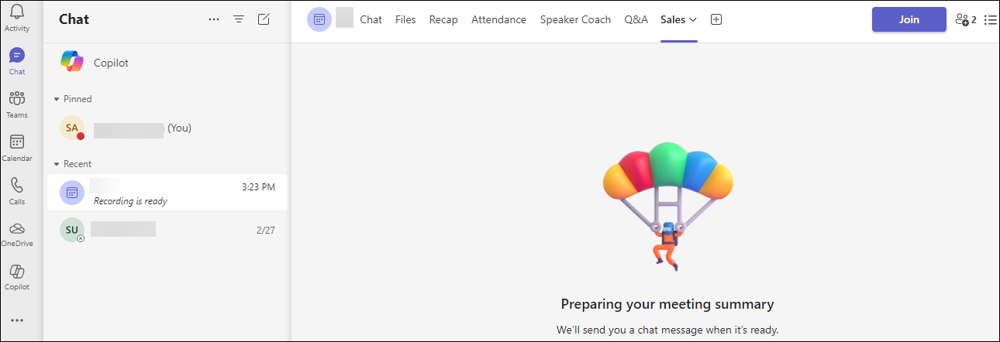
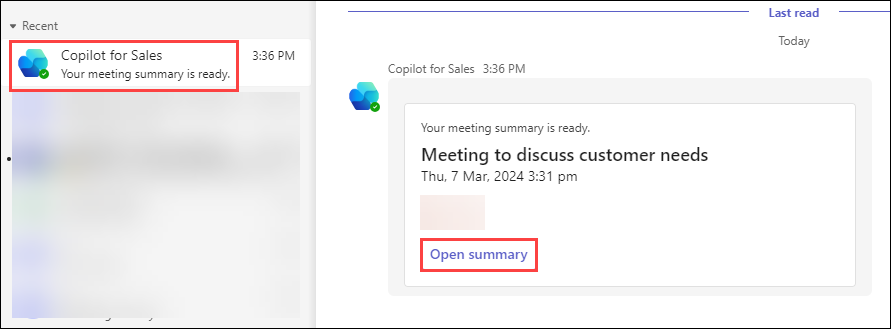
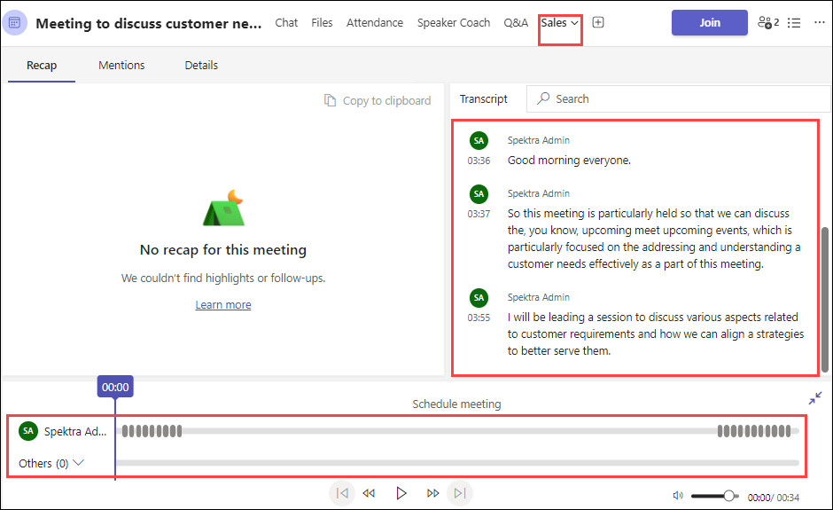
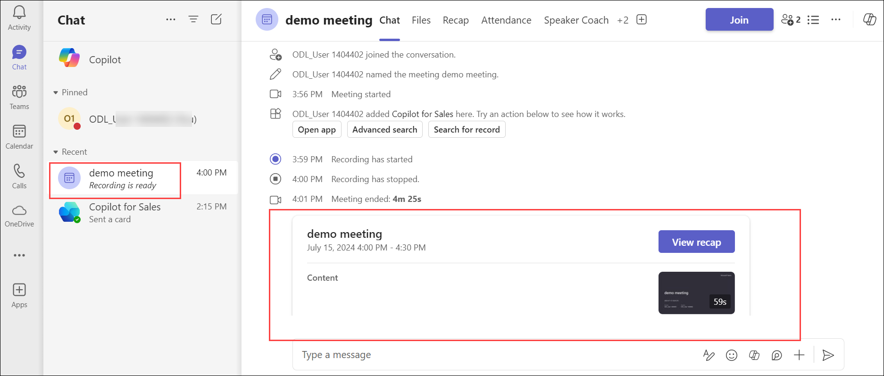

# Lab 04: Drive AI-powered sales 

# Capabilities in Teams 

# Elevate Sales Meeting 

## Lab Overview

In this lab, you'll explore the Copilot for Sales app within Microsoft Teams, designed to enhance your meeting efficiency with sales contacts. You will learn how to view the meeting preparation card, access and edit connected CRM records, and receive real-time sales tips during meetings. These features are aimed at helping you stay focused and accelerate deal closures.

## Lab Objectives

In this, you wil perform:

- Task 1: Create a Teams Meeting
- Task 2: Use Microsoft Copilot for Sales AI in a recorded sales meeting 
- Task 3: Analyze sales meetings with AI-generated meeting summaries

### Task 1: Create a Teams Meeting

- You must invite at least one external participant to the meeting.
- You must transcribe the meeting for Copilot for Sales to generate insights.
- If you create a recurring meeting, the Copilot for Sales app is added to all occurrences of the meeting.

1. Navigate to **Teams** from Outlook by clicking on the **More Options** on the top left of the Outlook Window.

   

1. Select **Calendar** from the left pane and click on **+New Meeting** from the top right corner.

   

1. Provide the following details to create a new meeting and click on **Send**.

      - **Provide a name for the meeting (1)**
      - **Add the users you would like to add to the meeting (2)**
      - **Mention the Date and Time of the meeting (3)**
      - **Add the channel (Optional) (4)**
      - **Outline what will be discussed during the meeting (5)**

           

### Task 2: Use Microsoft Copilot for Sales AI in a recorded sales meeting 

**Note:** There are two ways we can schedule a meeting.

**Automatically** - When you schedule a meeting with a contact who is saved to your CRM, the system automatically enables Microsoft Copilot for Sales when it records and transcribes the meeting.

**Manually** - 

1. Navigate to the **Calendar** in **Teams** and **join** the meeting.

   

1. Click on **Apps** and select **Copilot for Sales**.

   

1. Select **Save**.

   

1. Start the **recording and transcription**.

   

### Task 3: Analyze sales meetings with AI-generated meeting summaries

1. Open the recording and click on the **Sales** Tab.

      **Note:** You might receive the below pop-up stating that the summary will take a while to show up and will notify via chat when it has fetched the insights.

   

1. Go to the meeting chat in your chat list, or open the event on your calendar in Teams, and select the **Copilot for Sales** tab and select **Open summary**.

   

1. Review the recording.

   

- Alternative approach to review the recording.

   

## Review

In this lab, you have understood how to use Copilot for Sales during teams meetings.

### You have successfully completed the lab.
