# Lab 04: Drive AI-powered sales
# Capabilities in Teams 

# Elevate Sales Meeting 

## Lab Overview

In this lab, you'll explore the Copilot for Sales app within Microsoft Teams, designed to enhance your meeting efficiency with sales contacts. You will learn how to view the meeting preparation card and record the meeting. Copilot for Sales uses the recorded call and transcript to generate and summarize rich meeting insights. The meeting summary provides an overview of how the conversation went. It includes action items and relevant keywords, a breakdown of customer sentiments during the call, and more

## Lab Objectives

In this, you wil perform:

- Task 1: Create a Teams Meeting
- Task 2: Use Microsoft Copilot for Sales AI in a recorded sales meeting 
- Task 3: Analyze sales meetings with AI-generated meeting summaries

### Task 1: Create a Teams Meeting

- You must invite at least one external participant to the meeting.
- You must transcribe the meeting for Copilot for Sales to generate insights.
- If you create a recurring meeting, the Copilot for Sales app is added to all occurrences of the meeting.

1. Navigate to **Teams (2)** from Outlook by clicking on the **More Options (1)** on the top left of the Outlook Window.

   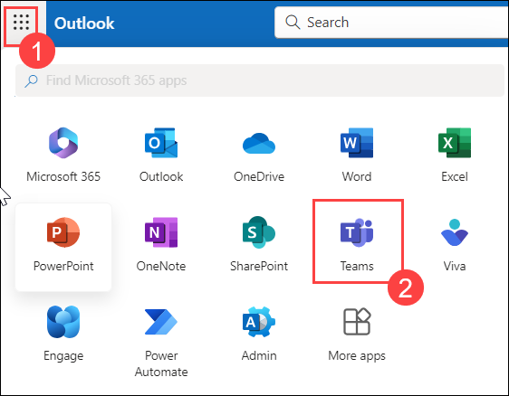

1. Select **Calendar** from the left pane and click on **+New Meeting** from the top right corner.

   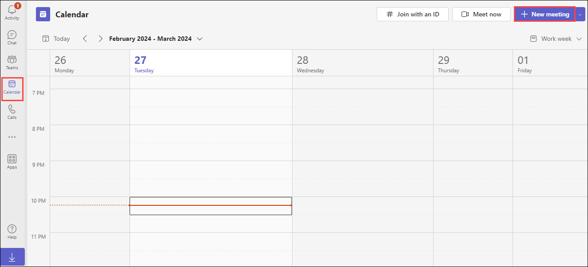

1. Provide the following details to create a new meeting and click on **Send**.

      - **Provide a name for the meeting (1)**
      - **Add the users you would like to add to the meeting  (2)** (*You can provide the email of the user present in team chat*)
      - **Mention the Date and Time of the meeting (3)**
      - **Add the channel (Optional) (4)**
      - **Outline what will be discussed during the meeting (5)**

           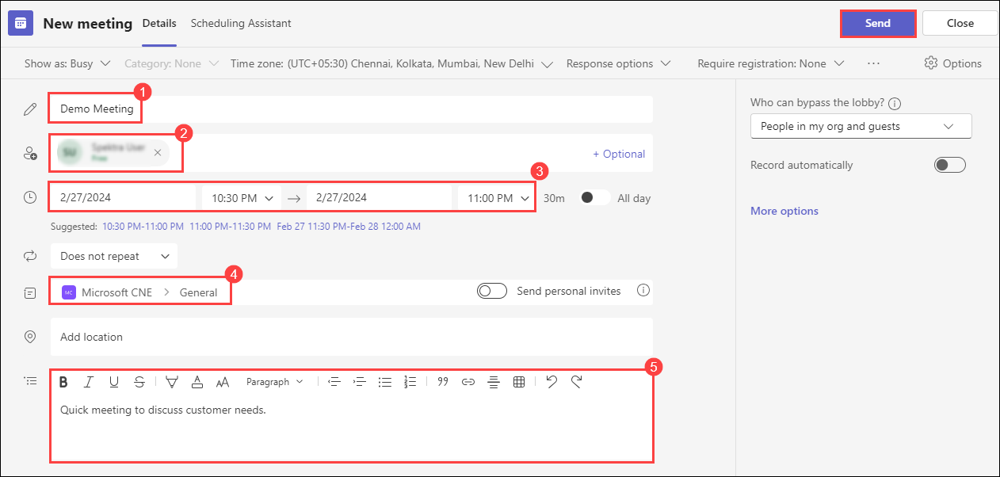

### Task 2: Use Microsoft Copilot for Sales AI in a recorded sales meeting 

**Note:** There are two ways we can schedule a meeting.

**Automatically** - When you schedule a meeting with a contact who is saved to your CRM, the system automatically enables Microsoft Copilot for Sales when it records and transcribes the meeting.

**Manually** - 

1. Navigate to the **Calendar** in *Teams,*  then select the meeting name **(1)** and click on **Join(2).** 

   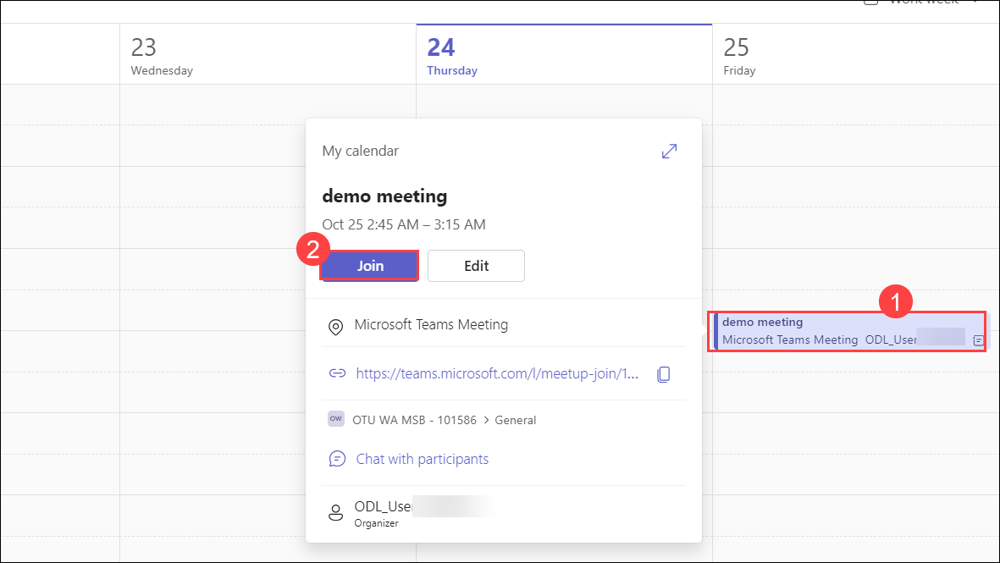

1. Open the **Copilot for Sales (1)** chat and click on **About (2).**

   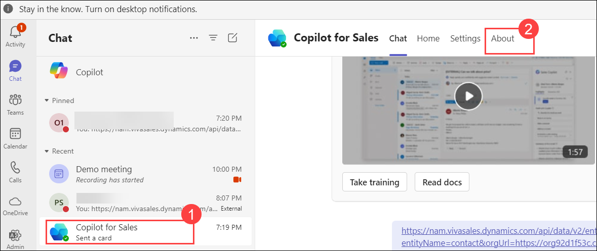

1. Click on **Open (1)** drop down and select **Add to a meeting (2).**  

   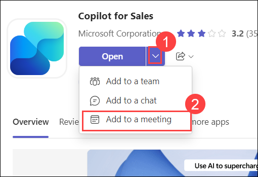

1. Select the meeting name **(1)** then click on **Set up (2)** drop-down and select **Set up a tab (3).**

   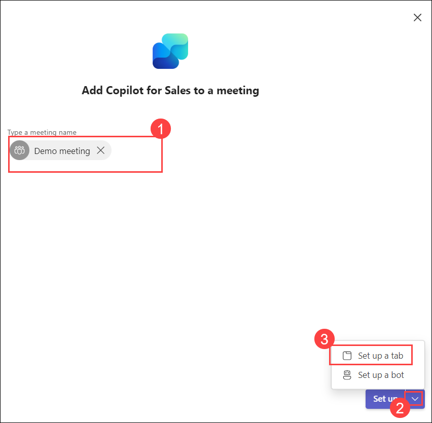

1. Click on **Save.** 

1. Open the meeting and Start the **recording and transcription**. Then Begin by speaking for a few minutes.

   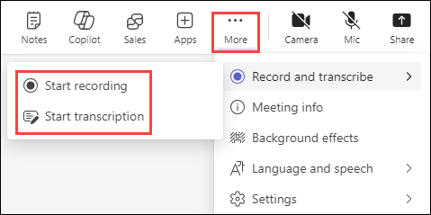

### Task 3: Analyze sales meetings with AI-generated meeting summaries

1. Stop the **recording** and **leave** the meeting. You will then be able to access the recording.

1. Open the recording chat and click on the **Sales** Tab.

      **Note:** You might receive the below pop-up stating that the summary will take a while to show up and will notify via chat when it has fetched the insights.

   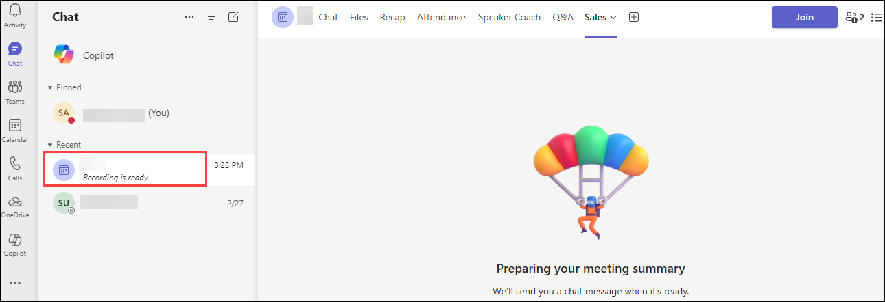

1. In the mean time you can proceed with next task.Then come back check.   

1. Once the insights are fetched, click on **Sales** tab. There you can review the recording that includes both **Recording (1)** and **Transcription (2)** of the meeting.

   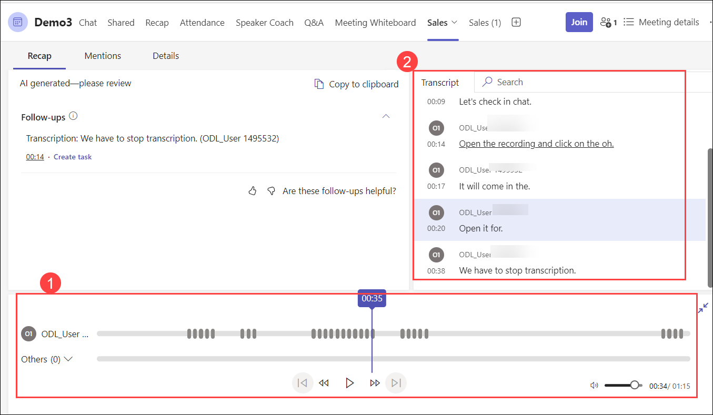

### Task 4: Explore AI-generated meeting Summaries with new Options.

1. Naviagte to the meeting chat in your chat list, select the **Copilot for Sales (1)** tab and select **Open recap (2)**.

   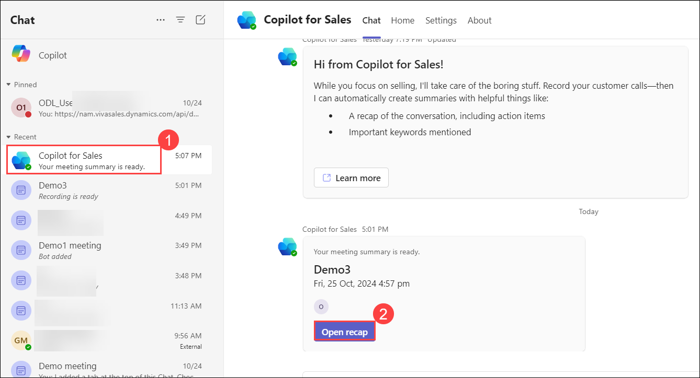

1. Navigate to **Sales (1)** tab, there you can find an option to **Draft email (2)** click on it. It will directly draft a ready Summary email to meeting participants.

   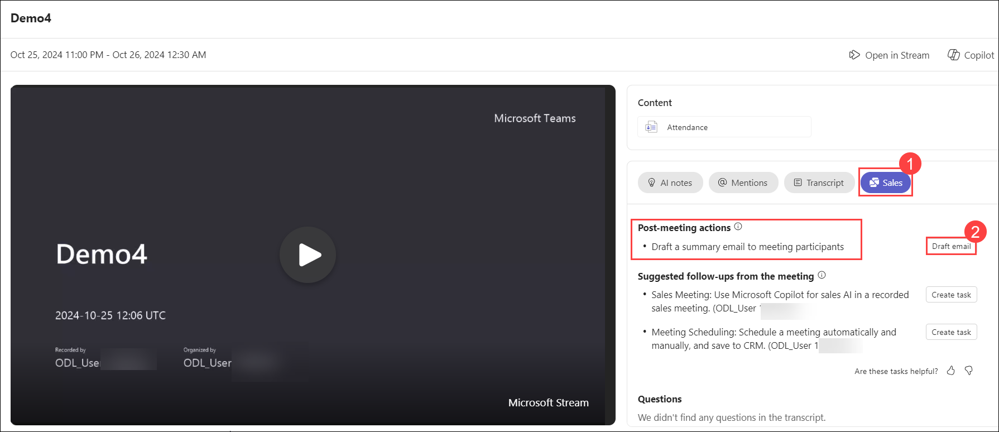

1. Here, you can view the already generated email summary of the meeting, which can be sent to the participants by clicking on **Open in Outlook Web.**

   

1. It also displays the **Keywords** mentioned during the meeting.

   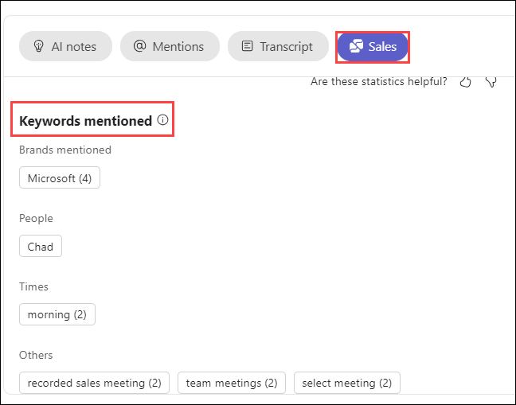

1. Navigate to **Transcript** tab, to view the meeting transcript, where you also have the option to download it in **.docs** and **.vtt** format.

   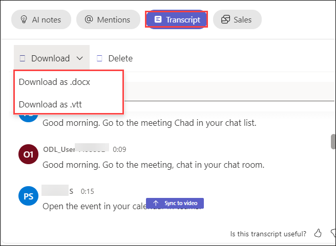

1. Navigate to **AI notes,** to view details of the discussions from the meeting session.

   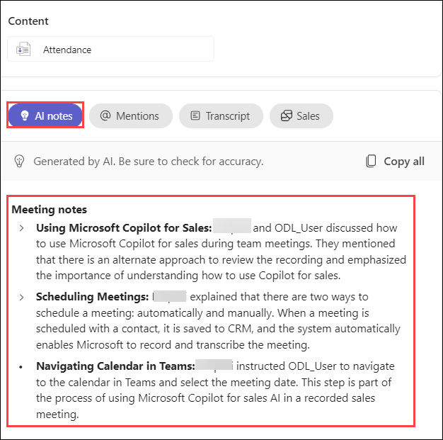

- Create a Task in Dynamic 365   

   You can create tasks in a Dynamics 365 Teams recording session to document or train others on a business process. In Dynamics 365, tasks are a way to organize work into specific actions that must be completed by a certain date.

1. Navigate back to **Sales (1)** tab, click on **Create task (2).**

   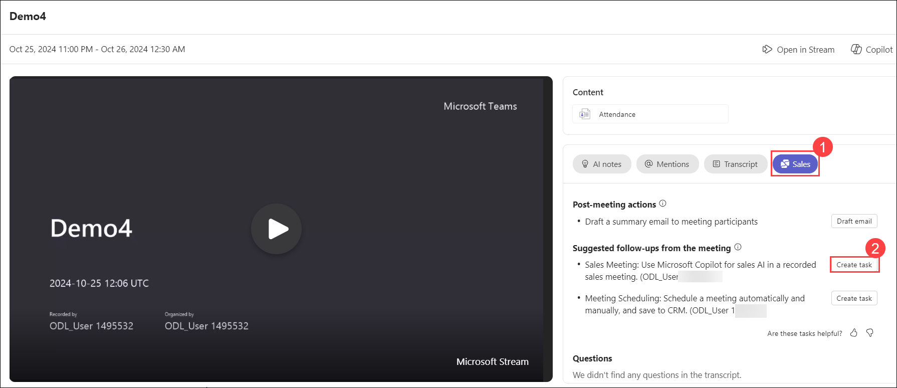

1. On the **Create a task in Dynamic 365** page, provide the following details.

   - Enter the **Subject** name **(1)**
   - In the **Connected to (2)** field, provide the name of the meeting participant contact record that you have created in ***Lab 2 - Task 1.***
   - Provide the **Due date** for the task.**(3)**
   - Provide the **Description** pertaining to the task. **(4)**
   - Click on **Create. (5)**

     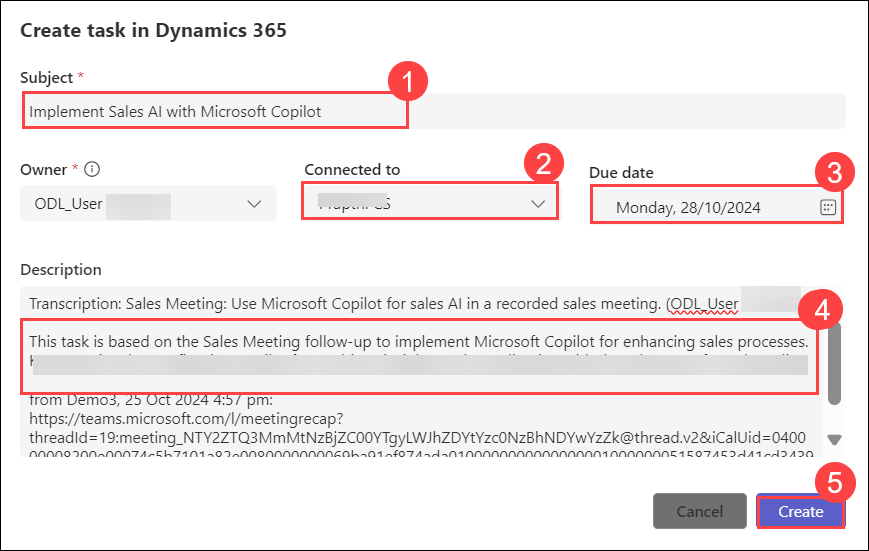

1. Navigate back to **Sales** tab, click on **Open task** to review the task.

   

1. Review the task, click on **Save and Close**  

   

1. Navigate back to **Outlook.** Open the participant's email, and access **Copilot for Sales.** Scroll down to the Contact Saved section, click on the **ellipses (...) (1)** and select **Open in Dynamics 365 (2).**

   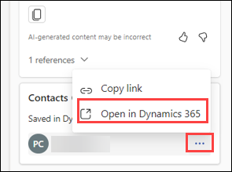

1. In **Dynamics 365,** you can find the details of the task created by the ODL user.

   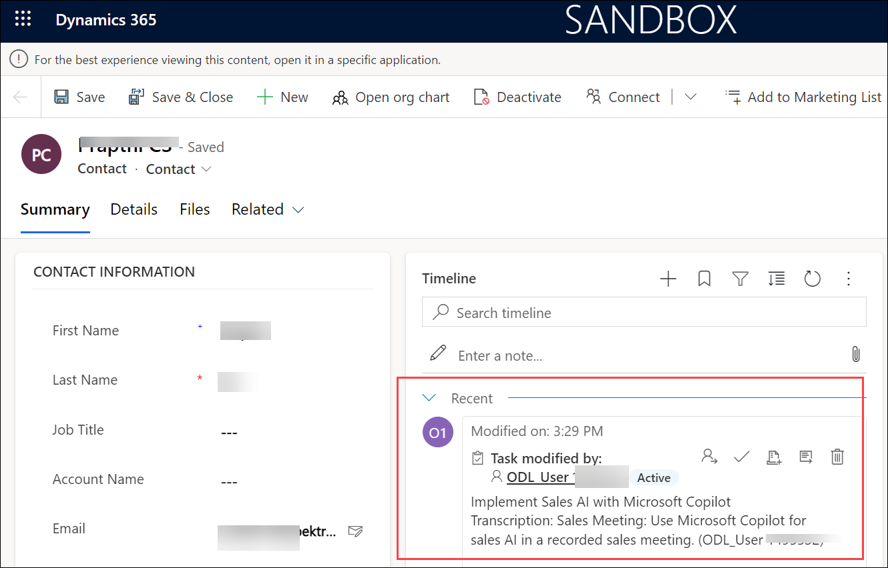

## Review

In this lab, you have understood how to use Copilot for Sales during teams meetings.

### You have successfully completed the lab.
