# Lab 05: Customize Microsoft Copilot for Sales (in Teams and Outlook) 

## Lab Overview

Many sales organizations customize their CRM to meet their business needs. Microsoft Copilot for Sales is preconfigured to work with contact, opportunity, and account records. The admin experiences allow for sales organizations to define what matters to them, helping to ensure that their sales teams have the necessary CRM data accessible to them.

In this lab, you will explore how Microsoft Copilot for Sales integrates with CRM to support both out-of-the-box and custom entities. You will learn how to set up and prioritize key records, mark records as editable, and make fields mandatory to enhance data access and quality. You will also explore different features in Outlook.

## Lab Objectives

- Task 1: CRM customizations and controls in Teams and Outlook
- Task 2: Discover more options in Microsoft Copilot for Sales (in outlook) 

### Task 1: CRM customizations and controls (in teams) 

In this task, you will learn how to customize and configure Copilot for Sales to better align with your organization’s CRM needs. You will explore Copilot AI settings, manage forms by adding new record types and filters, and modify record types by adding, reordering, or removing fields. Additionally, you will configure editing permissions for records and fields, enable new contact creation, and define key fields for mini views. These customizations ensure that sales teams have relevant, structured, and high-quality CRM data accessible within Teams and Outlook.

### Task 1.1: Copilot AI

1. Click on **Apps** and open **Copilot for Sales**.

   

1. Click on **Settings** and select **Copilot AI** under Environment tab and review the features provided. Enable or disable based on your preferences.

   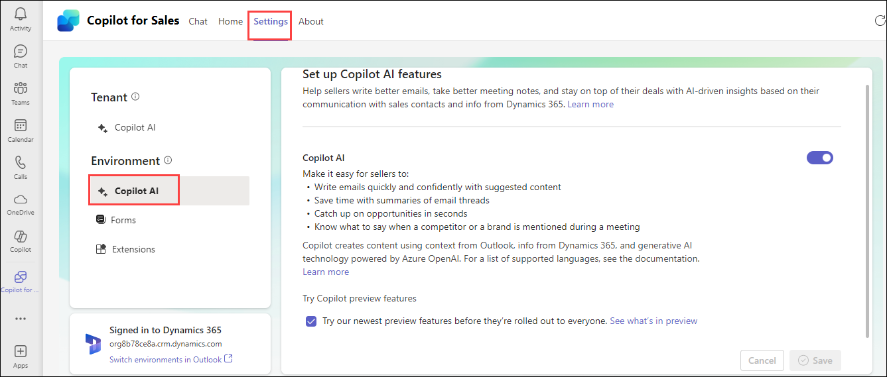

### Task 1.2: Forms

- ### Add a new record type

1. Click on **Settings** and select **Forms** under Environment tab and click on **Add record type**.

   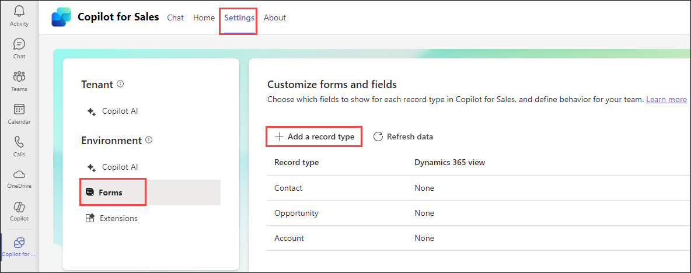

1. In the **Add a record type**, select a record type to **add**, and then select **Next**.

   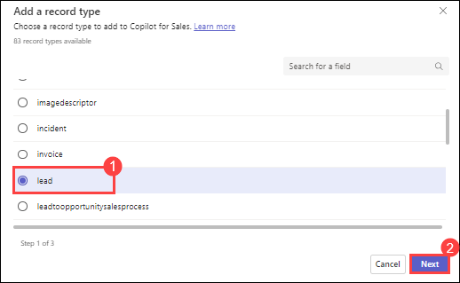

1. In the **Select the relationship** for (record type) window, select the **relationship** to existing record types or fields in Copilot for Sales, and then select **Next**.

   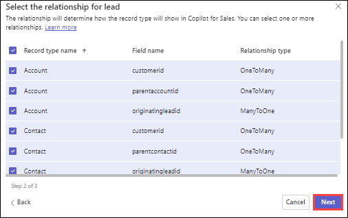

1. In the **Select the view** for (record type) window, select the view to define how a list of records for a specific record type is displayed, and then select **Add**.

   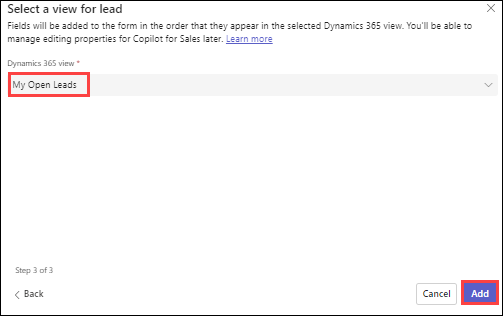

1. On the record type settings page, select **Publish** to save your changes.

   

- ### View filters used in a view

1. Select a record type for which you want to see the query used in the selected view.

1. Select **View filters** under the **Manage fields** section.

   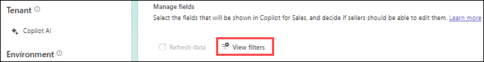

1. To copy the query XML, select **Copy XML**.

## Task 1.3:  Modify record types not based on a CRM view
- ### Add fields

1. Select a **record type** to which you need to add fields.

   

1. In the **Manage fields** section, select **Add fields**.

   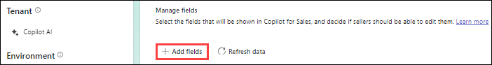

1. In the **Add fields** window, **select** fields to display in the form, and then select **Add**.

   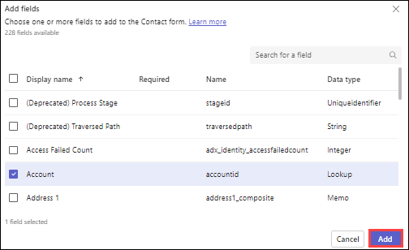

      **Note:** The new fields are added after the existing fields, but you can reorder them as needed.

1. Select **Publish** to save your changes.

- ### Reorder fields

1. Select the record type in which you need to reorder fields.

1. In the **Manage fields** section, hover over the field you want to reorder, and then select the **Move up** or **Move down** arrows.

   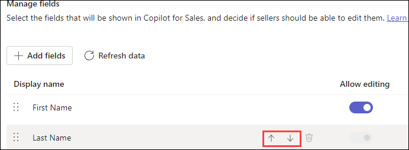

   **Note:** You can also drag the field to change its order.

1. Select **Publish** to save your changes.

- ### Remove fields

1. Select the record type from which you need to remove fields.

1. In the **Manage fields** section, hover over the field you want to remove from the form, and then select **Remove field**.

   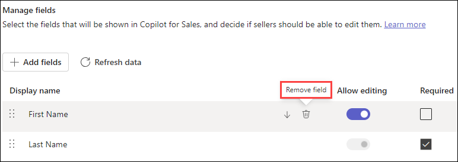
   
1. Select **Publish** to save your changes.

- ### Mark fields as required in Copilot for Sales

1. Select a record type for which you need to mark the fields as required.

2. In the Manage fields section, select **Required** for the fields that you want to mark as required.

   

3. Select **Publish** to save your changes.

## Task 1.4: Configure editing of records and fields
- ### To allow editing of records

1. Select a record type for which you need to allow editing.

1. Turn on **Edit records inside Copilot for Sales** to allow sellers to **edit** all relevant fields in that record type.

   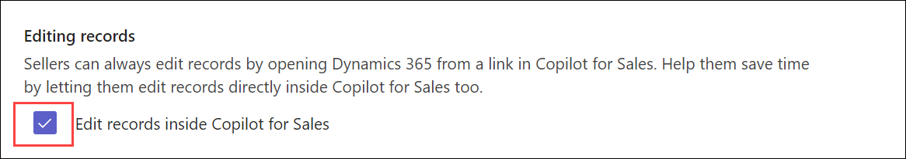

1. To restrict editing for specific fields, **turn off Allow edit** for corresponding fields in the **Manage fields** section.

1. Select **Publish** to save your changes.

- ### To configure new contact creation:

1. Select the **Contact record** type.

1. Under **Creating records**, select **Create new records inside Copilot for Sales**.

   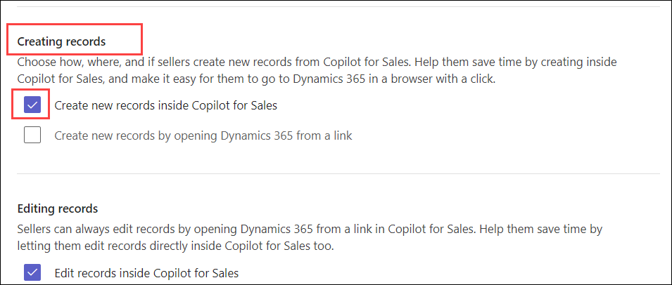

1. Select **Publish** to save your changes.

- ### To select key fields

1. Select the record type in which you need to select fields for mini view.

1. In the **Key fields** section, select fields from the list.

   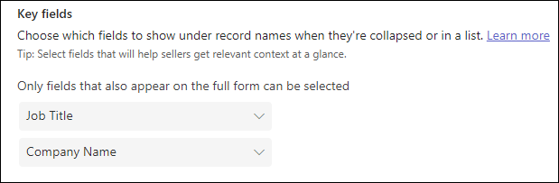

1. Select **Publish** to save your changes.

     **Note:** The changes made will reflect in **Outlook**.

### Task 2: Discover more options in Microsoft Copilot for Sales (in outlook) 

In this task, you will learn how to explore additional options available in Copilot for Sales within Outlook. You will discover how to switch CRM environments, view diagnostic data for troubleshooting, and share feedback with Microsoft. You will also learn how to access helpful resources such as the product overview, introductory videos, and privacy policies. Finally, you will explore how to sign out and reconnect to different CRM systems or environments. These options provide greater flexibility, transparency, and control for both sellers and administrators.

### Task 2.1: Switch environments or CRM

> **Note:** To **Switch environments**, there should be two or more environments created in power apps platform.

1. In the **Copilot for Sales** pane, click on the **Options(...) (1)** on the top right and click on **Signed into Dynamics 365 (2)** then select **Switch environment (3)**.

    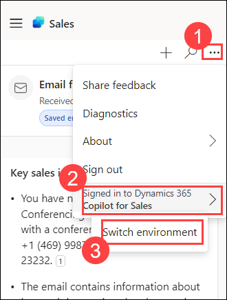

1. Here you can switch between the environment.    

    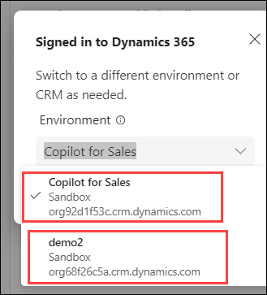

### Task 2.2: View diagnostics data

1.	Open **Copilot for Sales**.

1.	Select the **Options(...)** in the upper-right corner, and then select **Diagnostics**.

      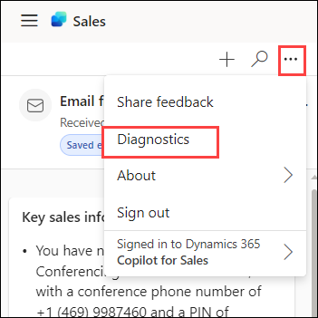

1.	Select **Copy details** to copy the diagnostics data, and then paste the data into an email, Teams chat, or any other medium you like to use to share it with technical support team.

      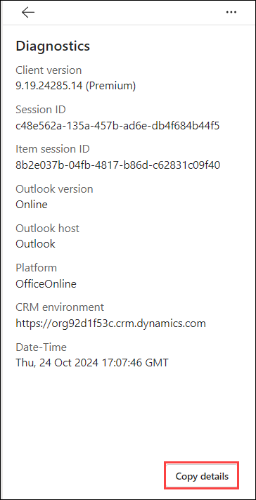

### Task 2.3: Share Feedback

1.	Open the Customer mail and naviagte to **Copilot for Sales** in Outlook.

2.	Select **Options(...) (1)** in the upper-right corner, and then select **Share feedback (2)**.
     
      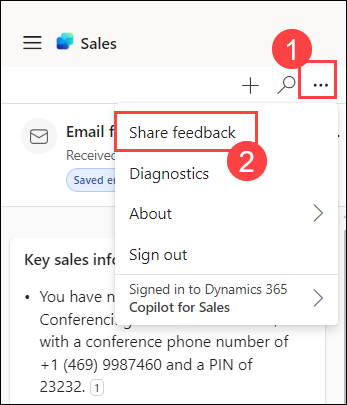

4.	Enter your responses in the feedback form and then select **Send**.
     
      

### Task 2.4: Video related to Copilot for Sales

1. Select **Options(...)** in the upper-right corner, and then select **About** > **Watch video**.
      
      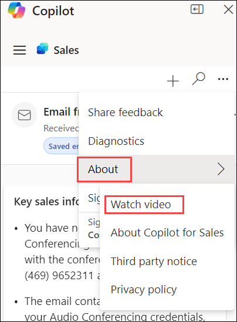

1. The video provides a brief introduction about the **Copilot for Sales**
      
      
   

### Task 2.5: About Copilot for Sales

1. Select **Options(...)** in the upper-right corner, and then select **About** > **About Copilot for Sales**. It provides an overview on how we can boost sales performance by using Copilot for Sales.
      
      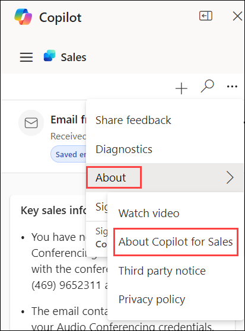
   
      
      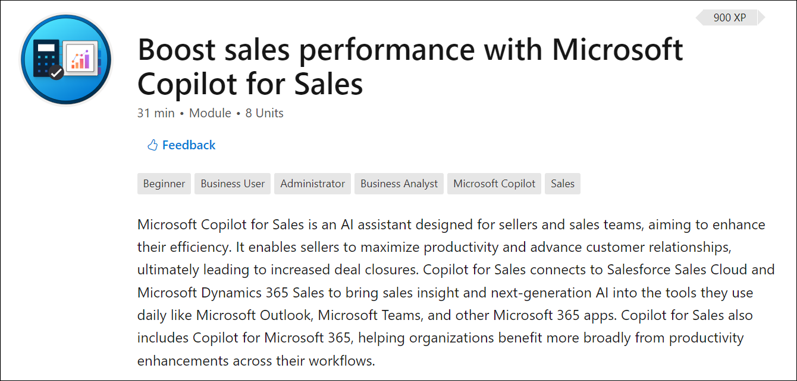    

### Task 2.6: View Privacy policies for Copilot for Sales

1.	Open **Copilot for Sales**.

1.	Select **Options(...)** in the upper-right corner, and then select **About** > **Privacy policy**. To view Microsoft Privacy policies.
     
      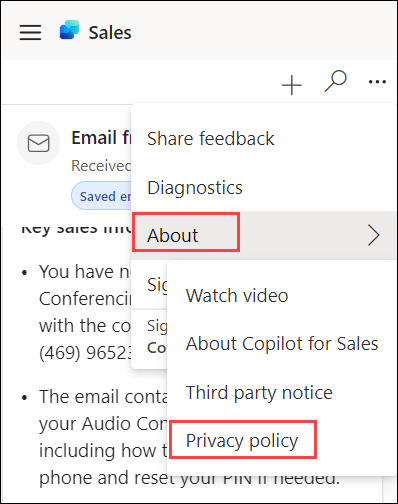

1.	Please go through the **Microsoft Privacy policy documentation** as per your requirement.
      
      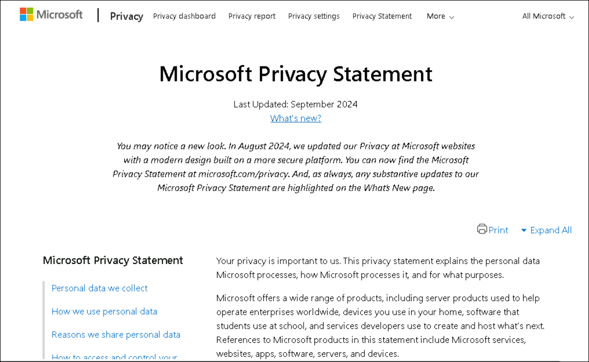

### Task 2.7: Sign out of Copilot for Sales

When you sign in and reconnect to the same CRM system and environment, your information is restored to the state it was in before you signed out. If you connect to a different CRM system or a different environment, the information is not restored.

1.	Open **Copilot for Sales** in Outlook.

2.	Select **Options(...) (1)** in the upper-right corner, and then select **Sign out (2)**.
      
      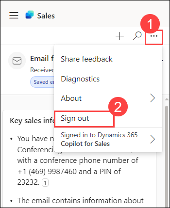

## Summary

In this lab, you have completed the following tasks:

- Explored CRM customizations and controls in Copilot for Sales (Teams and Outlook)
- Configured Copilot AI settings and customized record types, forms, and fields
- Enabled editing, mandatory fields, and contact creation in Copilot for Sales
- Discovered additional options in Outlook such as switching environments, viewing diagnostics, sharing feedback, and accessing privacy policies

## You have successfully completed the Hands on lab.

By completing this lab series on **Dynamics-365-Copilot-for-Sales**, you gained practical experience in integrating, customizing, and applying AI-powered features to streamline sales processes. You learned how to connect Copilot with CRM systems, create and manage contacts, and capture customer interactions. You explored AI capabilities in Outlook for summarizing and drafting communications, and in Teams for analyzing meetings with AI-generated summaries, action items, and insights. Additionally, you customized record types, fields, and controls in Teams and Outlook to ensure CRM data meets business needs. These skills enable you to enhance collaboration, improve efficiency, and drive more effective, AI-powered sales outcomes.
