# Pre-configurations

## Overview

This task will guide you through setting up an environment in Microsoft Power Apps, which provides storage for apps, flows, data, and other resources. You will learn how to create a database to use Dataverse as a data store. Dataverse is a cloud-scale database used to securely store data for business applications. It not only offers data storage but also allows you to implement business logic, enforce business rules, and automate processes against the data.

## Lab Objectives

In this lab, you will perform:

- Task 1: Create an environment in Power Apps
- Task 2: Install Copilot for Sales in Outlook
- Task 3: Install and pin Copilot for Sales in Teams
- Task 4: Pre-configure policies to analyze sales meetings with AI-generated meeting summaries

### Task 1: Create an environment in Power Apps

In this task, you will create a new environment in Power Apps with Dataverse enabled. The environment provides the storage and security foundation needed for apps, flows, and business data. You will also configure user roles and install Dynamics 365 Sales Pro to prepare for Copilot for Sales.

1. Navigate to the [Power Platform admin center](https://admin.powerplatform.microsoft.com/), click Sign in, and log in with the credentials provided below.

      - **Email/Username:** <inject key="AzureAdUserEmail"></inject>

      - **Password:** <inject key="AzureAdUserPassword"></inject>

1. Click on **Environments (1)** from the left pane and click on **+ New (2)**.

   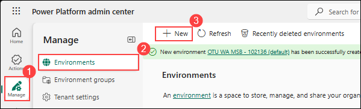

1. Enter **Copilot for Sales** as the name **(1)**, ensure that **Add a Dataverse data store** is set to **Yes (2)**, leave Group unchanged since it is optional, and then click **Next (3)**.

   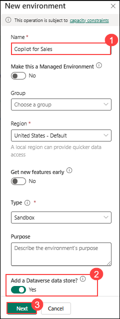

1. Under **Security Group**, click on **+ Select**.

    

1. Select **None (1)** for security roles and click on **Done (2)**.

   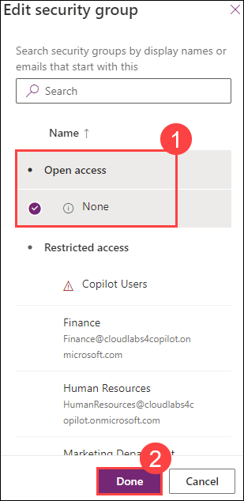

1. Make sure **Enable Dynamics 365 apps** is set to **Yes (1)**, select **Sales Pro (2)** for **Automatically deploy these apps** and click on **Save (3)**.

   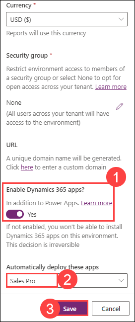

1. Once the environment is in **Ready** state, select the environment and click on **Settings**.

   

1. Click on **Users** under **Users + permissions**.

   

1. Select the **user** and click on **Manage security roles**.

   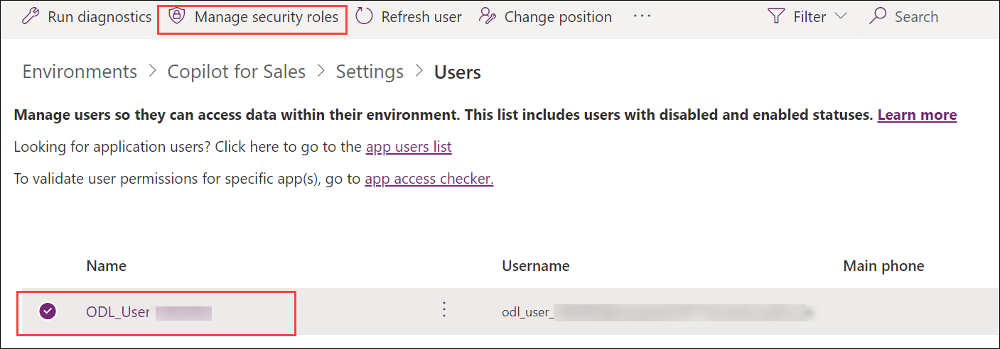

1. Make sure **Basic User**, **Salesperson** and **Sales Copilot User** is checked and click on **Save**.

### Task 2: Install Copilot for Sales in Outlook 

In this task, you will learn how to install Copilot for Sales as an integrated app from the Microsoft 365 admin center. By default, the app is installed in Fixed mode, where users receive the app automatically and cannot remove it. You will also explore how to manage the app's configuration, add and remove users, and monitor its usage within the Microsoft 365 admin center. 

1.	Sign into the **[Microsoft 365 admin center](https://admin.microsoft.com/)**. In the left pane, click **Show all**.
   
1. Select **Settings (1)**, choose **Integrated Apps (2)**, click **Available Apps (3)**, and in the AppSource window search for **Copilot for Sales (4)** and select **Copilot for Sales (5)**.

    

3. On **Copilot for Sales**, page cClick on **Deploy App**.

   

4.	In the **Configuration** step, it will display the apps to be deployed, and then select **Next**.

      

5.	In the **Users** step, select **Just me(<inject key="AzureAdUserEmail"></inject>) (2)**, and then select **Next (2)**.

      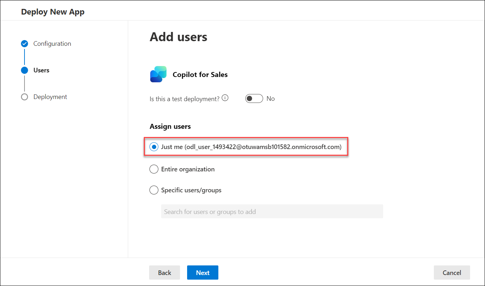

6. Click on **Accept permissions**.

      

7. Select the **<inject key="AzureAdUserEmail"></inject>**.

      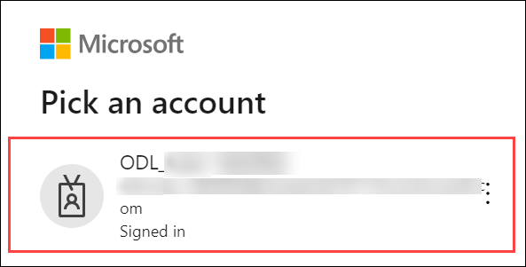
   
8.	In the **Deployment** step, once it displays as **Permission accepted**, select **Next**.

      

9.	In the **Deployment (Finish)** step, review the selected settings, and then select **Finish deployment**.

      

10. When the deployment is complete, click on **Done**.

11. Under **Deployed Apps (1)**, verify **Copilot for Sales (2)**.

      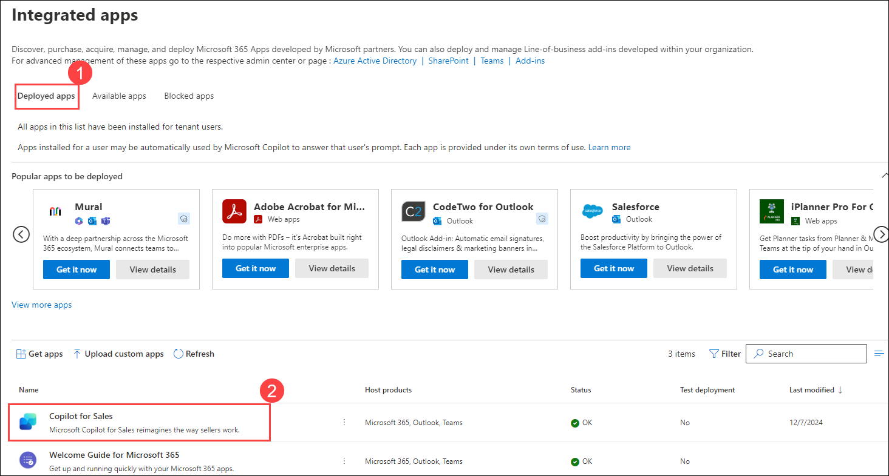

### Task 3: Install and pin Copilot for Sales in Teams 

In this task, you will configure Microsoft Teams to install and pin the Copilot for Sales app. By doing so, users can easily access Copilot from Teams chats, meetings, and collaboration spaces. You will create and apply setup policies to make the app available and pinned by default for your users.

1. Sign into the **[Teams admin center](https://admin.teams.microsoft.com/)**.
   
1. In the left pane, select

   - **Teams apps (1)**
   - Select **Setup policies (2)**
   - Click on **Add (3)**

           

1. Enter a name for the policy and verify if **User pinning** is on.

    
   
1. Under Installed apps, select **Add apps**.  In the **Add installed apps** panel, search for the **Copilot for Sales** app and click **Select**

      **Note:** You can also filter apps by app permission policy.

   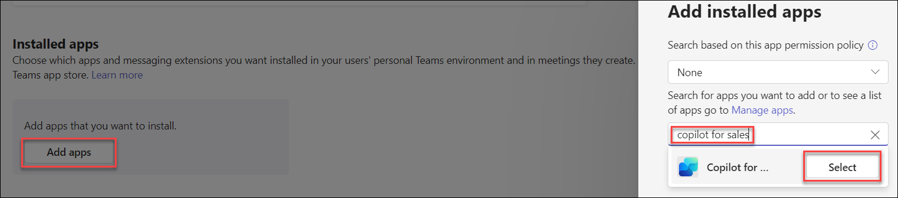 

1. Select **Add** again to install the listed apps.

    

1. Under ****Pinned** apps**, select **Add apps**. In the **Add pinned apps** panel, search for the **Copilot for Sales** app and select **Add**.

    

1. Select **Add** again to pin the listed apps. 

1. Under App bar or Messaging extensions, arrange the apps in the order that you want them to appear in Teams. 

1. Select **Save**.

   

1. Click on **Save** for User pinning.

    

### Task 4: Pre-configuration to Analyze sales meetings with AI-generated meeting summaries

In this task you will focuse on enabling transcription and recording policies in Teams. These settings are necessary for Copilot to analyze meetings and generate AI-powered summaries. By turning on transcription across calling, live events, meetings, and voicemail, you ensure that sales meetings can be captured and enhanced with actionable insights

1. Navigate to https://admin.teams.microsoft.com/. If promted sign in with the ODL credential provided in the Environment tab.

1. Navigate to **Manage users (1)** under ***Users,*** then click on the ODL user **(2).**

   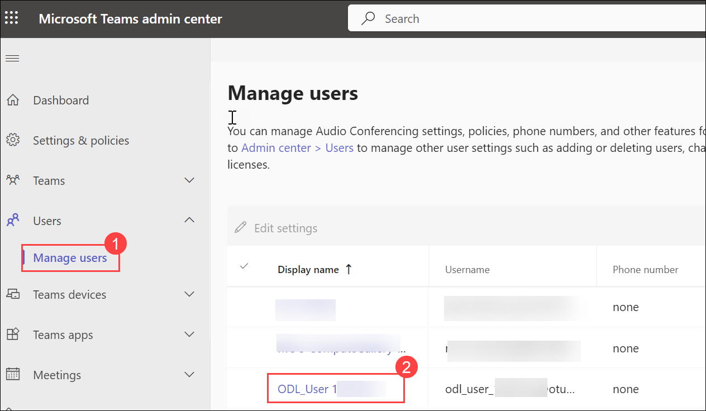

1. Click on **Policies (1)**, scroll down to ***Calling policy*** and then click on **Org-wide default settings (2).** 

   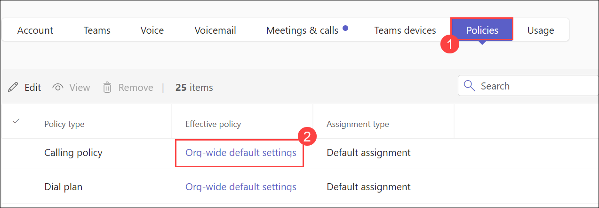

1. Naviage to ***Transcription*** toggle button, switch it **On** and click on **Save.**

   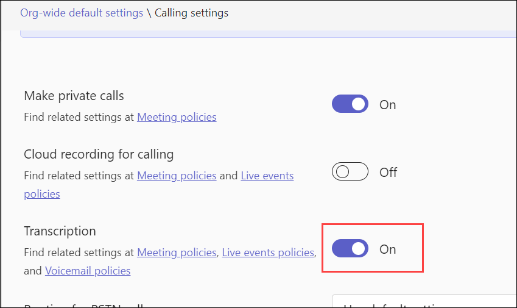

1. Navigate back to **Policies (1),** scroll down to **Live event policy**  and then click on **Org-wide default settings (2).**

   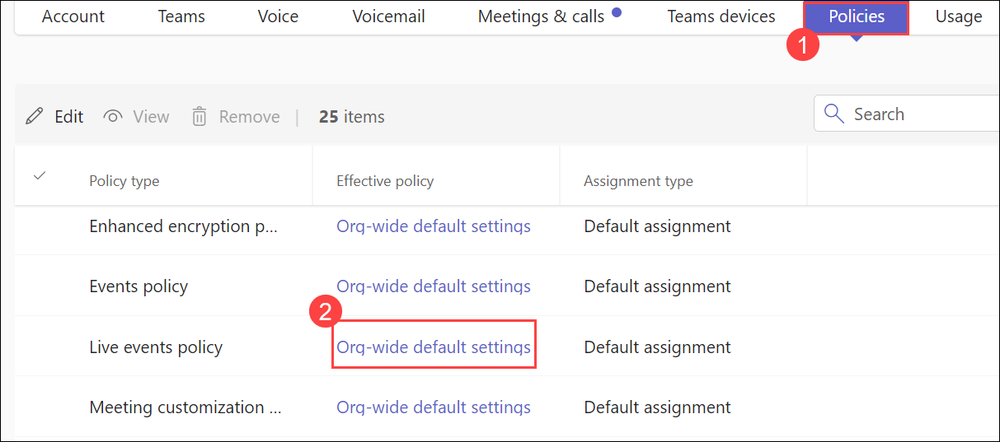

1. Switch the ***Transcription for attendees*** toggle button **On (1)** and then click on **Save (2).**   

   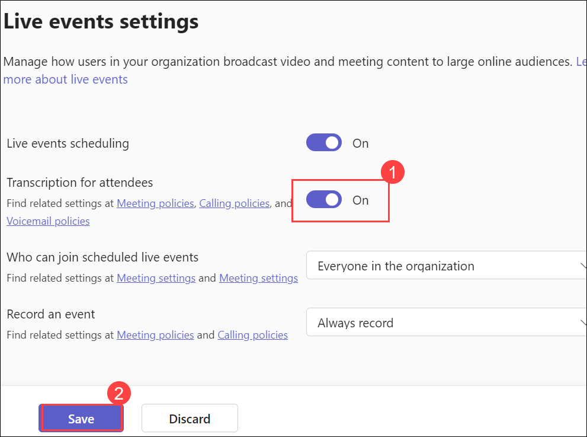

1. Navigate back to **Policies (1),** scroll down to **Meeting policy**  and then click on **Org-wide default settings (2).**    

   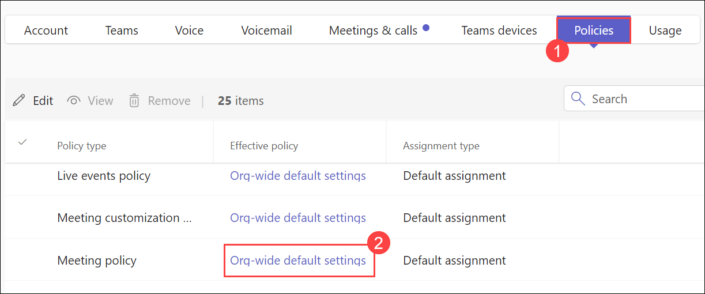

1. Scroll down to ***Recording and Transcription,*** then switch the ***Transcription*** toggle button **On** and then click on **Save.**

   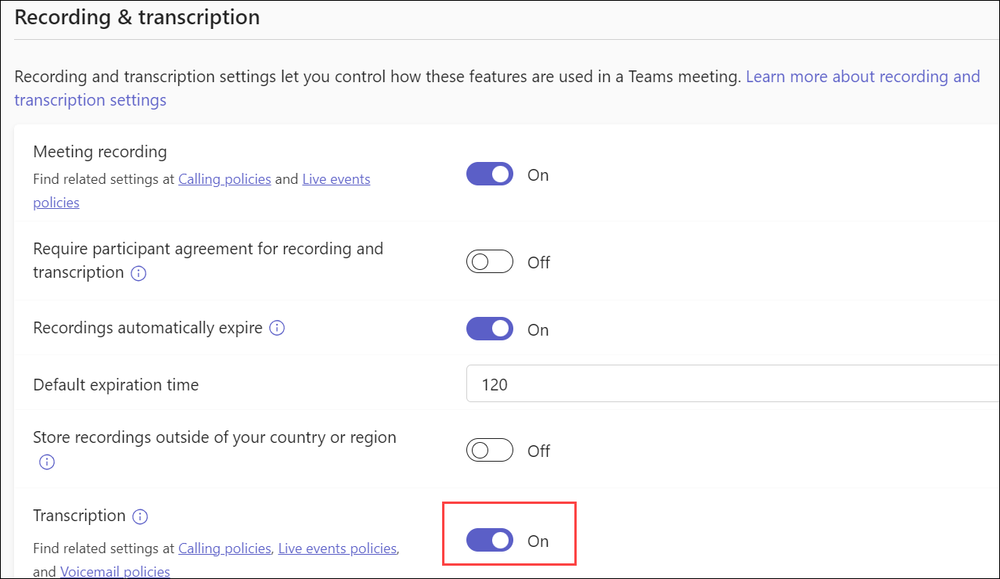

1. Navigate back to **Policies (1),** scroll down to **Voicemail policy**  and then click on **Org-wide default settings (2).**       

   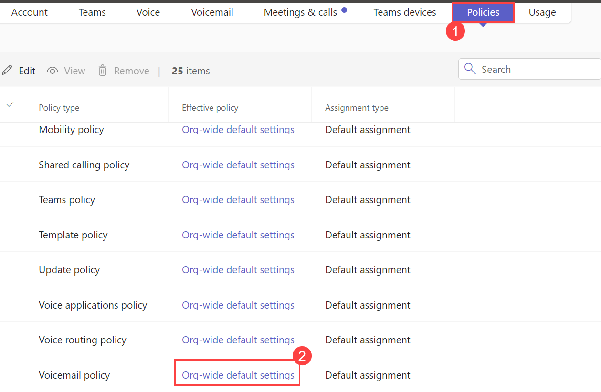

1. Switch the ***Voicemail Transcription (1)*** and ***Translation for transcription (2)*** toggle button **On** and then click on **Save.**

   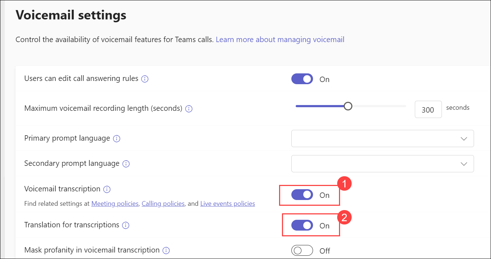

## Summary

In this lab, you have:

- Created a Power Apps environment with Dataverse and Sales Pro
- Installed Copilot for Sales in Outlook
- Installed and pinned Copilot for Sales in Teams
- Enabled transcription and recording policies for AI-generated meeting summaries

### You have successfully completed the lab. Now click on Next from the lower right corner to move on to the next page.

 
