# Pre-configurations

## Create an environment in Power Apps

1. Navigate to [Power Platform admin center](https://admin.powerplatform.microsoft.com/) and click on **Sign In** and sign in with the credentials provided under **Environment Details** Tab.

1. Click on **Environments** from the left pane and click on **New**.

   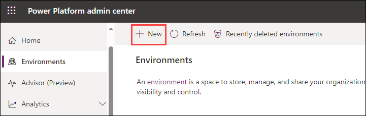

1. Provide a name and make sure **Add a Dataverse data store** is selected to **Yes** , leave **Group** as it is, no need to select as it is optional and click on **Next**.

   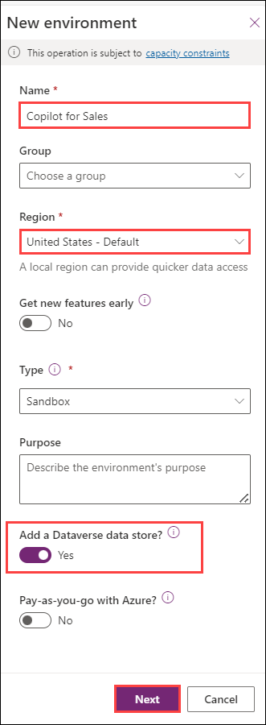

1. In **Security Group** Click on **Select**.

    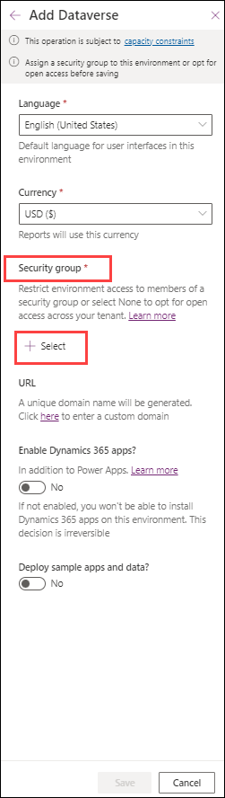

1. Provide **None** for security roles and click on **Done**.

   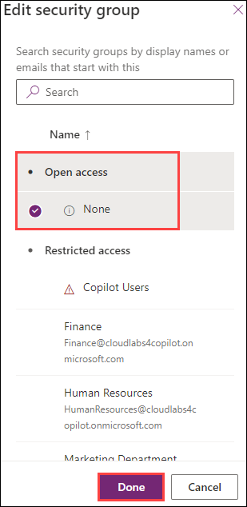

1. Make sure **Enable Dynamics 365 apps** is set to **Yes**, select **Sales Pro** for **Automatically deploy these apps** and click on **Save**.

   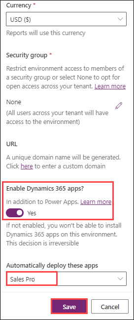

1. Once the environment is in **Ready** state, select the environment and click on **Settings**.

   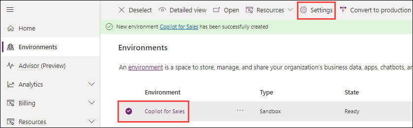

1. Click on **Users** under **Users and permissions**.

   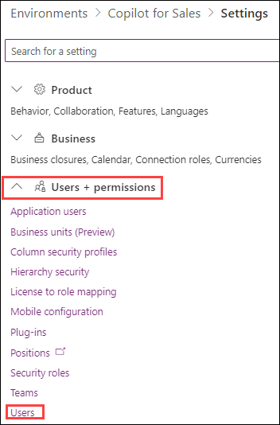

1. Select the **user** and click on **Manage security roles**.

   

1. Make sure **Basic User**, **Salesperson** and **Sales Copilot User** is checked and click on **Save**.

## Install Copilot for Sales in Outlook 

1.	Sign into the **[Microsoft 365 admin center](https://admin.microsoft.com/)**.
   
2.	In the left pane, select

   - **Settings (1)**
   - Select **Integrated Apps (2)**
   - Click on **Available Apps (3)**
   - In the AppSource window, search for **Copilot for Sales (4)** and select it.

        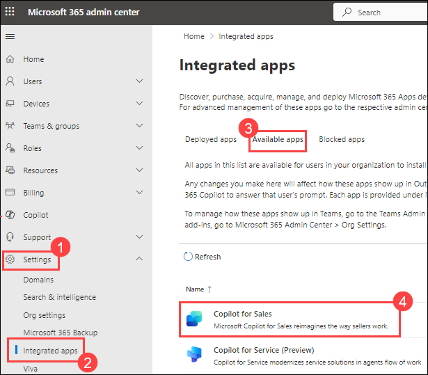

3. Click on **Deploy App**.

   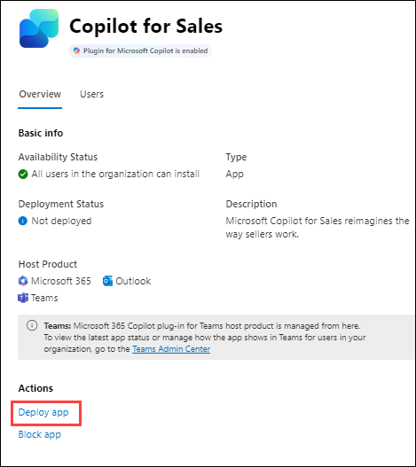

4.	In the **Configuration** step, it will display the apps to be deployed, and then select **Next**.

      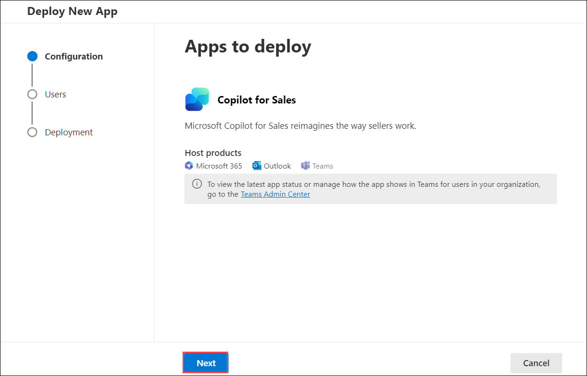

5.	In the **Users** step, select **Just me**, and then select **Next**.

      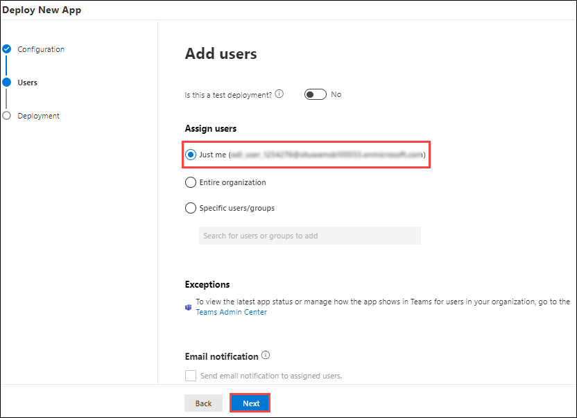

6. Click on **Accept permissions**.

      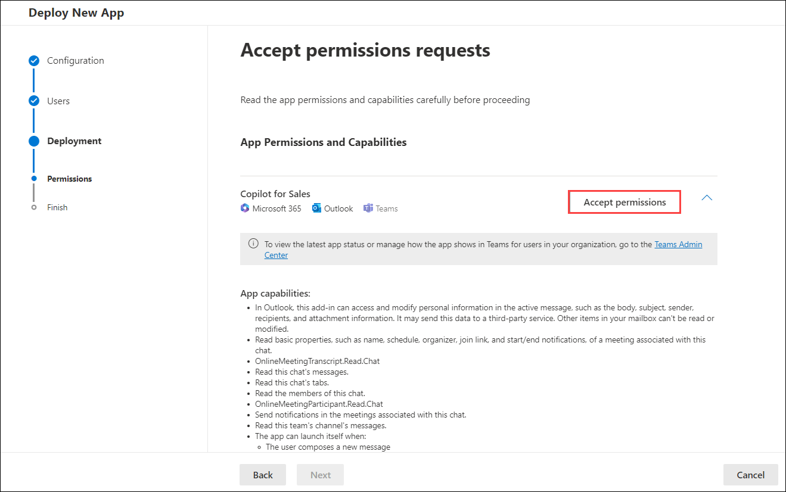

7. Select the **Account**.

      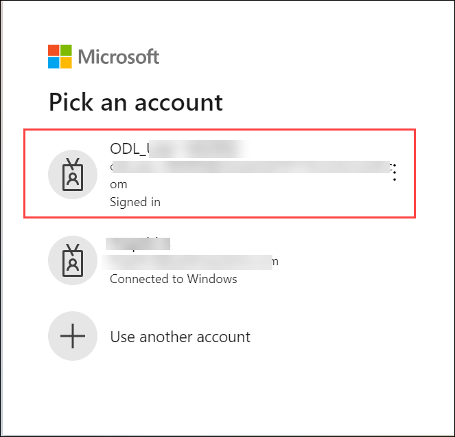
   
8.	In the **Deployment(Permissions)** step, once it displays as **Permission accepted** ,select **Next**.

      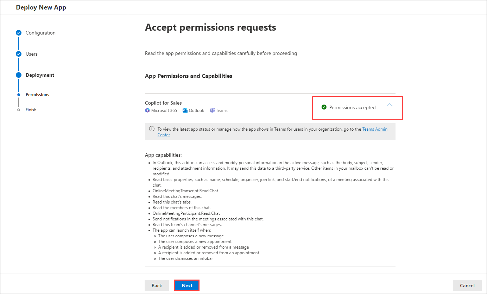

9.	In the **Deployment (Finish)** step, review the selected settings, and then select **Finish deployment**.

      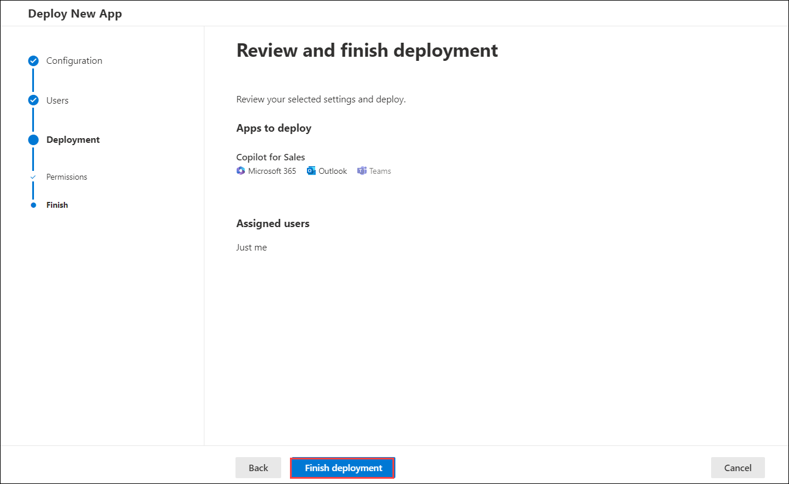

10. When the deployment is complete, select **Done**.

11. Verify **Copilot for Sales** is available under **Deployed Apps**.

      

## Install and pin Copilot for Sales in Teams 

1. Sign into the **[Teams admin center](https://admin.teams.microsoft.com/)**.
   
1. In the left pane, select

   - **Teams apps (1)**
   - Select **Setup policies (2)**
   - Click on **Add (3)**

      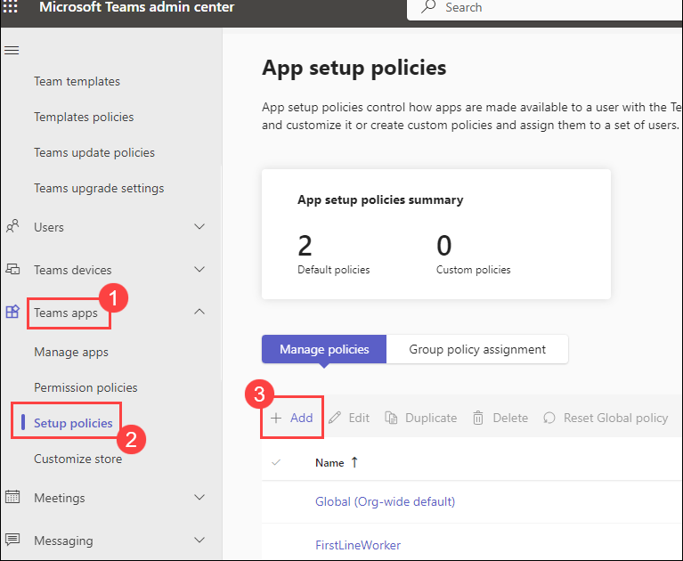     

1. Enter a name for the policy and verify if **User pinning** is on.

   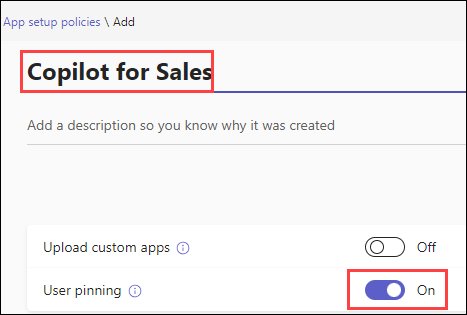 
   
1. Under Installed apps, select **Add apps**.  In the **Add installed apps** panel, search for the **Copilot for Sales** app and Select **Add**

      **Note:** You can also filter apps by app permission policy.

    

1. Select **Add** again to install the listed apps.

   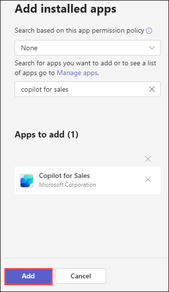 

1. Under ****Pinned** apps**, select **Add apps**. In the **Add pinned apps** panel, search for the **Copilot for Sales** app and select **Add**.

   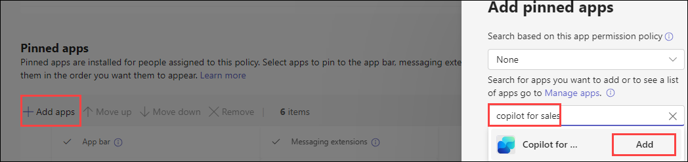 

1. Select **Add** again to pin the listed apps. 

1. Under App bar or Messaging extensions, arrange the apps in the order that you want them to appear in Teams. 

1. Select **Save**.

   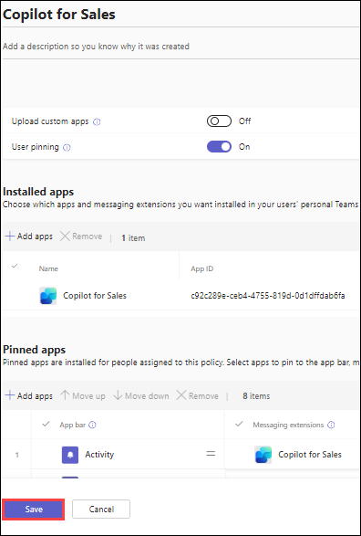

1. Click on **Save** for User pinning.

    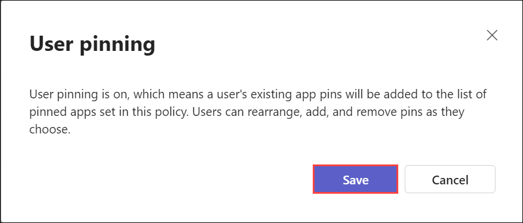
